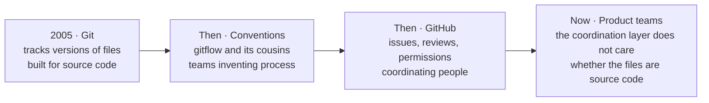
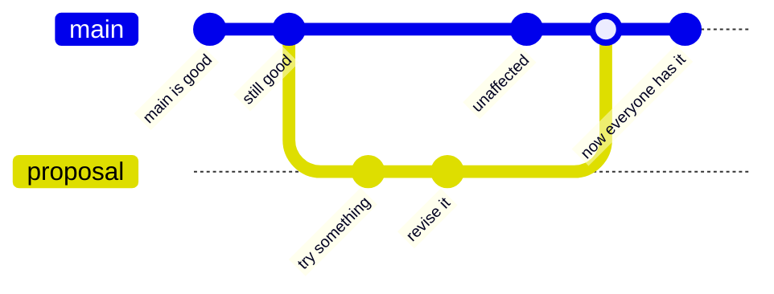

<svg xmlns="http://www.w3.org/2000/svg" viewBox="0 0 960 160" width="960" height="160">
  <rect width="960" height="160" rx="12" fill="#0B3D2E"/>
  <text x="48" y="58" font-family="system-ui, -apple-system, sans-serif" font-size="16" font-weight="600" letter-spacing="3" fill="#4ADE80" text-anchor="start">HOW WE GOT HERE</text>
  <text x="48" y="108" font-family="system-ui, -apple-system, sans-serif" font-size="44" font-weight="700" fill="#FFFFFF" text-anchor="start">Four steps, none of</text>
  <text x="48" y="140" font-family="system-ui, -apple-system, sans-serif" font-size="44" font-weight="700" fill="#FFFFFF" text-anchor="start">them planned</text>
</svg>

&nbsp;

Product teams are not adopting a developer tool. They are recognizing that collaborative knowledge work needs the same properties developers needed first: versioning, review, parallel changes, history, and machine accessibility.

&nbsp;

## A branch is a safe place to be wrong

Work happens off to the side. The main line keeps working the entire time.

The main line never broke while the work was happening, and nothing became shared until somebody merged it deliberately.

&nbsp;

---

Beyond the Backlog · Productside · September 2, 2026

---

[&larr; The comparison](01_the-comparison.md) · [Next: The frame &rarr;](03_the-frame.md) · [Run](run.md)
