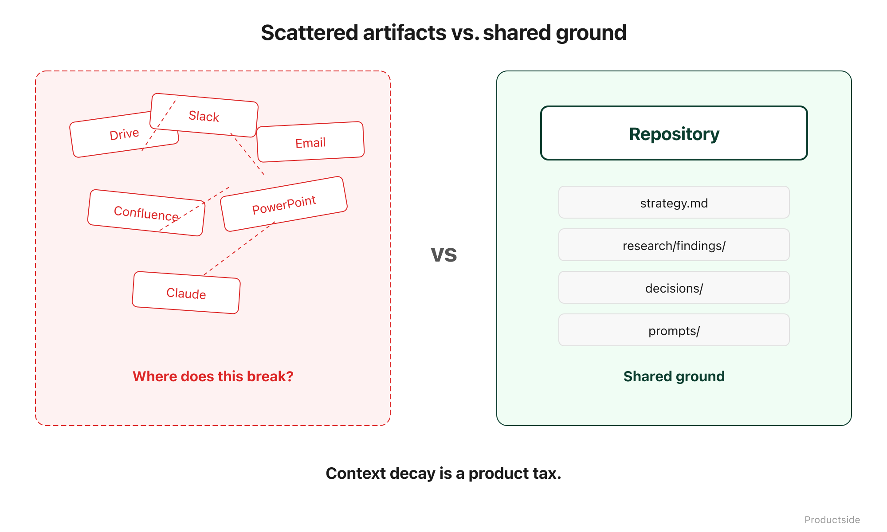

<svg xmlns="http://www.w3.org/2000/svg" viewBox="0 0 960 160" width="960" height="160">
  <rect width="960" height="160" rx="12" fill="#1a1a1a"/>
  <text x="48" y="58" font-family="system-ui, -apple-system, sans-serif" font-size="16" font-weight="600" letter-spacing="3" fill="#94D2BD" text-anchor="start">THE REAL PROBLEM</text>
  <text x="48" y="108" font-family="system-ui, -apple-system, sans-serif" font-size="48" font-weight="700" fill="#FFFFFF" text-anchor="start">Clarity keeps</text>
  <text x="48" y="148" font-family="system-ui, -apple-system, sans-serif" font-size="48" font-weight="700" fill="#FFFFFF" text-anchor="start">leaking.</text>
  <text x="912" y="140" font-family="system-ui, -apple-system, sans-serif" font-size="14" fill="#94D2BD" text-anchor="end">Productside</text>
</svg>

&nbsp;

## The Real Problem

Teams do archaeology instead of product work. Every Monday starts with the same ritual: hunting for the latest version of the strategy doc, re-reading a Slack thread to reconstruct a decision, copy-pasting context into an AI tool that forgot everything overnight.

&nbsp;

&nbsp;

This is not a tooling problem. It is a context decay problem. And it compounds.

**Research is scattered.** Customer interviews in one drive folder. Competitive analysis in another. Survey results in a third. Nobody has a single view of what you know.

**Decisions are buried.** The real decision happened in a Slack thread three weeks ago. The doc that was supposed to capture it either was never updated or was updated by someone who was not in the thread.

**Prompts are private.** Your best AI workflows live on individual laptops. When someone leaves, those workflows leave with them.

**Documents are duplicated.** Three copies of the PRD. Two copies of the positioning statement. One of them is current. You will not know which one until you ask, and the person who knows is in a meeting.

In plain English: every hour your team spends reconstructing context is an hour not spent on product work. That is the tax. It is invisible, it is constant, and it grows with every tool you add to the stack.

> **"Context decay is a product tax you pay every day you ignore it."**

&nbsp;

---

Beyond the Backlog · Productside · September 2, 2026

---

[← Previous](01_github-for-pms.md) · [Next: The Shift →](03_the-shift.md) · [Run](run.md)
