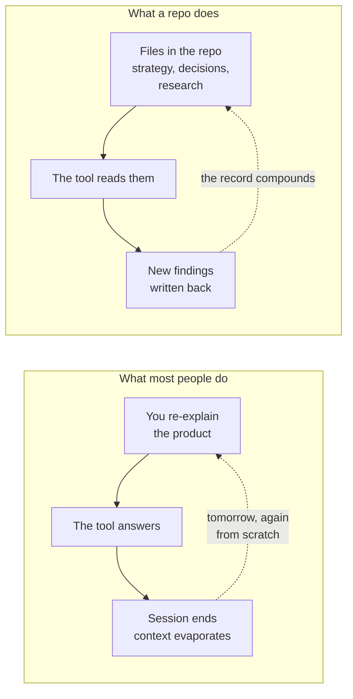

<svg xmlns="http://www.w3.org/2000/svg" viewBox="0 0 960 160" width="960" height="160"><rect width="960" height="160" rx="12" fill="#1a1a1a"/><text x="48" y="100" font-family="system-ui, -apple-system, sans-serif" font-size="44" font-weight="800" fill="#FFFFFF" text-anchor="start">Collaborative Sharing</text></svg>

## WF2: Clone a Shared Library and Install Its Skills

Here is the situation: Productside publishes a market intelligence skills library on GitHub. It contains prompts, frameworks, and workflows that any team can use to run competitive analysis, build battle cards, and generate market snapshots. The library is public. Anyone can read it. But reading it on the web is not the same as having it on your machine where an AI tool can use it.

Cloning copies the entire repository, including its history, to your local machine. Once it is there, you can install the skills so your AI assistant knows how to run them. This is not downloading a ZIP file. A clone maintains a live connection to the original, so when the library improves, you can pull those improvements down with a single command.

In plain English: you are telling the AI "go get this library and set it up so I can use it." The AI does the rest.

> **AI Prompt**
>
> "Clone the Productside Market Intelligence Skills repository here: https://github.com/Productside/Productside-Market-Intelligence-Skills, into my ~/Projects directory and install the skills so I can use them."

### Invisible Machinery

```
mkdir -p ~/Projects
cd ~/Projects
git clone https://github.com/Productside/Productside-Market-Intelligence-Skills.git
claude plugin install ~/Projects/Productside-Market-Intelligence-Skills
```

Why this clone happens here is why the ending works. Later in the show, Kenny will create a branch, make an improvement, and open a pull request. A pull request needs a branch. A branch needs a clone. By cloning now, we are setting the stage for the entire collaboration loop, not just running a skill.

## Why Not...?

This is the honest part. GitHub is not the only place teams store their work, and the other tools are not bad. But they solve different problems than the one we are addressing.

**Why not SharePoint?** SharePoint is excellent for storing and sharing documents within an organization. It handles permissions well, integrates with Office, and scales to enterprise. But it was not built for branching, comparing, or merging. When two people edit the same document, SharePoint either locks one out or attempts an auto-merge that often needs manual cleanup. There is no concept of "try this change on a branch and merge it if it works." The versioning is there, but it is a timeline you scroll through, not a structure you can reason about.

**Why not Confluence?** Confluence is a strong knowledge base. It handles long-form documentation, search, and team wikis well. But it is less suited to versioned review and experimentation. When you want to propose a change to a Confluence page, you edit the page. There is no "branch the page, try a different approach, and merge it back if it is better." The history tab shows what changed, but there is no built-in workflow for proposing, reviewing, and approving changes before they go live.

**Why not Claude Projects?** Claude Projects give you a persistent context window for AI conversations. That is genuinely useful. But a Claude Project is not a shared, governed workspace. It does not version your files. It does not let someone else on the team see what changed and why. It does not carry rules that the AI must follow. And when the project hits its context limit, the oldest context falls off. A repository does not forget.

The point is not "those tools are bad." The point is this: when the thinking changes, where does the change get tracked? If the answer is "someone updates a doc and hopes everyone notices," that is not version control. That is optimism.

## WF3: Give AI the Same Context as the Team

Most people use AI tools by explaining their product at the start of every conversation. "We are a B2B SaaS company that does X. Our main competitor is Y. Our positioning is Z." Every. Single. Session. The AI has no memory of yesterday's conversation. It does not know what the team decided last week. It starts from zero and you pay the tax of re-explanation.

A repository changes this. When you point an AI tool at a repository, it reads the files. Not just the data files; it reads the governance files too. CLAUDE.md tells it what the project is and how to work here. CONSTITUTION.md tells it what it must not do. The reference directory gives it background research. The skills directory gives it workflows. The AI is not starting from zero. It is starting from the team's accumulated knowledge.

> **AI Prompt**
>
> "Read this repository and tell me what skills are available, what frameworks they use, and what rules I should follow. Then recommend which skills should we install to help us get to a battle card comparing two large enterprise companies?"

### Invisible Machinery

The AI scans the repository structure:
```
# Read governance and context files
cat CLAUDE.md
cat AGENTS.md
cat CONSTITUTION.md

# Read reference materials and available skills
ls reference/
ls prompts/
ls skills/

# Parse skill definitions and recommend a workflow
```

It is not just listing files. It is reading the rules, understanding the frameworks, and making a recommendation based on what is actually available. The AI's answer is grounded in the repository, not in its general training data.



The left side is what most teams live with: a daily re-explanation loop. The right side is what a repository provides: a compounding record. The AI reads what the team already knows, produces new findings, and those findings get written back into the repository. Tomorrow, the AI starts from a richer baseline, not from scratch.

## WF4: Run a Shared Skill

Now we put it to work. Kenny has the repository cloned. The skills are installed. The AI knows the project context. Time to produce something real.

A shared skill is not a prompt you copy-paste from a blog post. It is a defined workflow that lives in the repository, has been reviewed by the team, and runs the same way every time. When Kenny asks the AI to build a battle card, the AI does not improvise. It follows a sequence of steps that the skill defines: gather intelligence, analyze positioning, compare strengths, identify gaps, and assemble the output.

> **AI Prompt**
>
> "My product is [name]. The competitor is [competitor name]. Focus on enterprise deals. Recommend the market intelligence skills and steps we should run to ultimately produce a working, up-to-date battlecard."

### Invisible Machinery

The AI routes the request through the skill chain:
```
# Route to the appropriate skill sequence
/mi-router → identifies: sweep, mine, snapshot, fuse, build

# Execute the skill chain
/mi-sweep    # Gather market intelligence from available sources
/mi-mine     # Extract competitive signals and positioning data
/mi-snapshot # Capture current state of competitor positioning
/mi-fuse     # Combine signals into a coherent analysis
/mi-build    # Assemble the battle card from analyzed data
```

Each step in the chain produces an intermediate artifact that the next step consumes. If any step fails or produces unexpected output, the chain can be restarted from that point rather than from the beginning.

### Failure Recovery

The live demo has a safety net for this workflow:

- **If the skill runs slowly:** Dean talks through what is happening at each stage while the audience watches the AI work. Narration over live processing is better than silence.
- **If the skill fails entirely:** Dean opens the saved output from a successful run and walks through the result. The teaching value is the same; the drama is slightly different.

### Adoption and Limits

**Use this when** more than one person or AI session works from the same product context. The value of shared skills scales with the number of people and sessions that use them. A solo PM working on one product gets convenience. A team of five working on a product line gets compounding knowledge.

**Skip it when** the work is genuinely solo and short-lived. If you are writing a one-off analysis that nobody else will ever reference, the overhead of a shared repository is not justified.

**What it does not do:** It does not decide anything for you. The battle card is a draft, not a deliverable. It does not guarantee accuracy; the AI is working from available sources, and those sources can be incomplete or wrong. Read the output critically. The skill tells the AI what to look for, not what to conclude.

---

&larr; [Collaborative Journey](02_collaborative-journey.md) &middot; Next &rarr; [Collaborative Improvements](04_collaborative-improvements.md) &middot; [Run](run.md)

Beyond the Backlog &middot; Productside &middot; September 2, 2026
