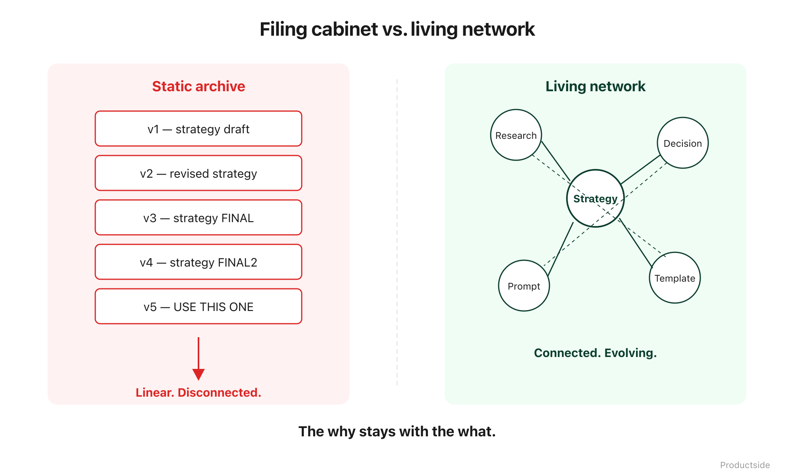

<svg xmlns="http://www.w3.org/2000/svg" viewBox="0 0 960 160" width="960" height="160">
  <rect width="960" height="160" rx="12" fill="#1a1a1a"/>
  <text x="48" y="58" font-family="system-ui, -apple-system, sans-serif" font-size="16" font-weight="600" letter-spacing="3" fill="#94D2BD" text-anchor="start">THE SHIFT</text>
  <text x="48" y="108" font-family="system-ui, -apple-system, sans-serif" font-size="48" font-weight="700" fill="#FFFFFF" text-anchor="start">From files to</text>
  <text x="48" y="148" font-family="system-ui, -apple-system, sans-serif" font-size="48" font-weight="700" fill="#FFFFFF" text-anchor="start">evolving knowledge.</text>
  <text x="912" y="140" font-family="system-ui, -apple-system, sans-serif" font-size="14" fill="#94D2BD" text-anchor="end">Productside</text>
</svg>

&nbsp;

## The Shift

A repo is not just a folder. It is a workspace where files carry their own history, where changes are reviewable before they become official, and where every edit is traceable to the person and the reason behind it.

&nbsp;

&nbsp;

The mental model matters. A Google Drive folder holds files. A GitHub repo holds files that know where they came from.

**Shared workspace.** Everyone sees the same version. Not "the version I downloaded Tuesday" or "the one I emailed to the team." The version.

**History.** Every change is recorded. Not in a separate changelog you have to remember to update. Automatically, as part of how the tool works.

**Review.** Before a change lands, someone else can look at it. Not after. Before. That is the difference between a strategy document that silently drifts and one that evolves with intention.

**Comparison.** You can see what changed between any two points in time. Side by side. Line by line. The commit history on those two files IS your strategy timeline.

**AI-readable context.** When your AI tools can read a repo, they start with what the team knows, not with what one person remembers to paste into a chat window.

In plain English: a repo turns your product thinking into something that has memory. Not memory you have to maintain. Memory that maintains itself.

> **"The why stays with the what."**

&nbsp;

---

Beyond the Backlog · Productside · September 2, 2026

---

[← Previous](02_the-real-problem.md) · [Next: Tool Fit →](04_tool-fit.md) · [Run](run.md)
