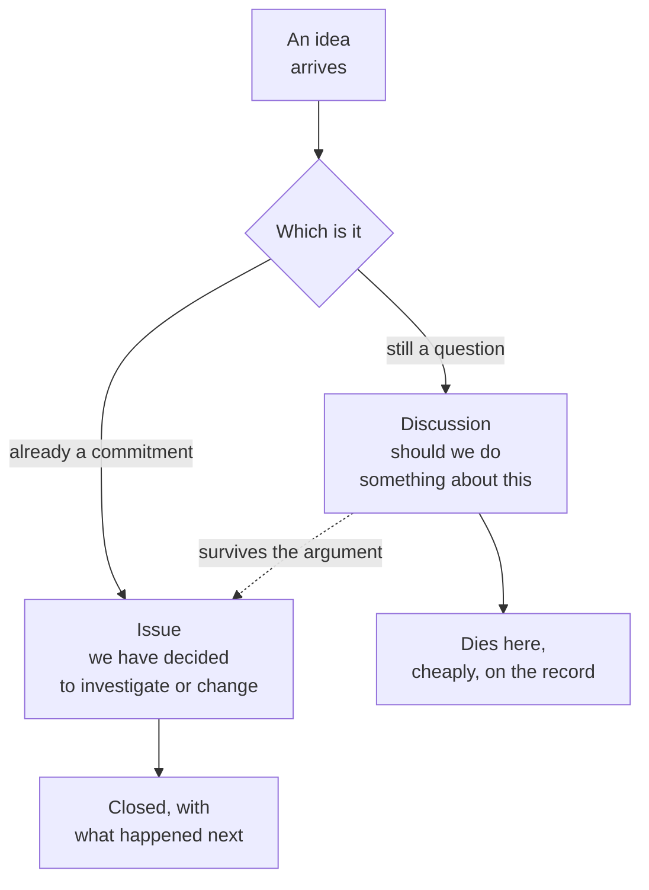
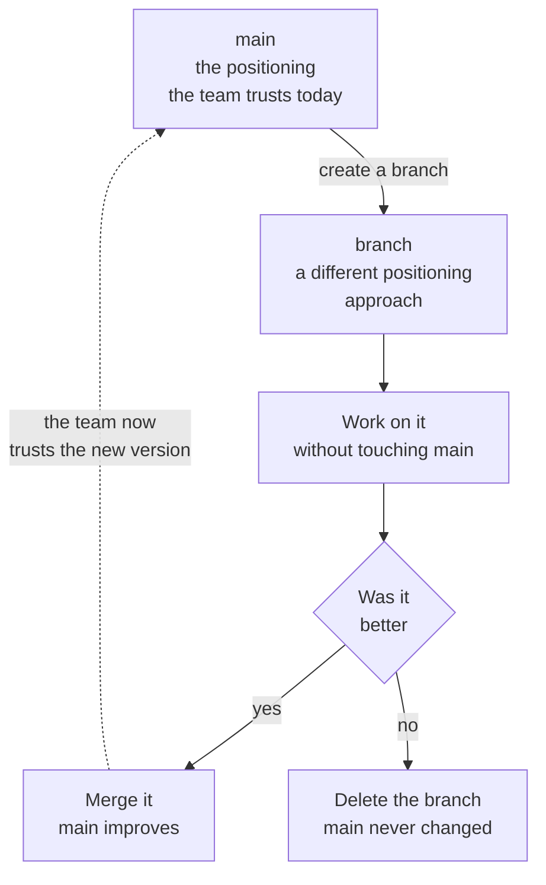

<svg xmlns="http://www.w3.org/2000/svg" viewBox="0 0 960 160" width="960" height="160"><rect width="960" height="160" rx="12" fill="#1a1a1a"/><text x="48" y="100" font-family="system-ui, -apple-system, sans-serif" font-size="44" font-weight="800" fill="#FFFFFF" text-anchor="start">Collaborative Improvements</text></svg>

## Discussion vs. Issue: Knowing Which Container to Use

Every team generates ideas faster than it can execute them. The question is not whether to capture them; it is where to put them so they do not clog the pipeline or disappear.

GitHub gives you two containers, and the distinction between them matters. A **Discussion** is for questions that are still open. Should we change the pricing model? Is our onboarding flow losing people at step three? What if we partnered with that vendor? These are conversations, not commitments. They deserve a place to live, but they do not belong in the same queue as work the team has agreed to do.

An **Issue** is for commitments. The team has decided that something needs to happen: investigate a competitor's new feature, update the battle card, fix the broken link in the onboarding email. An issue is assigned, trackable, and closable. It represents work, not wondering.

The flow between them is natural. An idea starts as a Discussion. People argue about it. Evidence gets added. If the idea survives the argument, someone converts it to an Issue. If it does not, it dies in the Discussion, cheaply and on the record. Six months later, when someone has the same idea, they can find the original conversation and read why it was deferred. That context is worth more than most people realize.



The important box in this diagram is the one that says "Dies here, cheaply, on the record." Most teams lose ideas silently. The idea was mentioned in a meeting, nobody wrote it down, and it evaporated. Or worse, it was written in a Slack thread that scrolled past the free-tier retention limit. A Discussion that gets closed is not a failure. It is a decision, recorded where anyone can find it.

## WF5: Branch to Improve What You Know Best

Now the collaboration model shifts. Up until this point, Kenny has been consuming shared resources: cloning a library, reading context, running a skill. In this workflow, he becomes a contributor. He sees something in the battle card output that could be better, and he is going to improve it.

In plain English: a branch is a safe place to be wrong before the team decides you are right. When you create a branch, you get your own copy of the work to change however you want. The version the team trusts, called `main`, is completely untouched. You can experiment, rewrite, delete sections, add new ones. If the result is better, you merge it back. If it is not, you delete the branch and main never knew you were there.

This is the fundamental difference between branching and "editing the live doc." In most collaboration tools, your changes are immediately visible to everyone. That creates pressure to get it right the first time, which means people either hesitate to contribute or they make small, safe changes that do not actually improve anything. A branch removes that pressure entirely.

> **AI Prompt**
>
> "Go to my clone of the Market Intelligence Skills repo. Make sure main is current, then create a branch called improve-battle-card so I can update the skill."

### Invisible Machinery

```
git switch main
git pull
git switch -c improve-battle-card
```

Three commands. The first switches to main so you start from the team's trusted version. The second pulls any changes other people have made since your last sync. The third creates a new branch and switches to it. Everything you do from this point forward happens on the branch, not on main.

## SME Feedback Flow

Here is where subject-matter expertise meets the collaboration model. Kenny reviewed the battle card and has specific feedback. It is accurate but not seller-ready. It reads like an intelligence brief, not a tool a sales rep would actually use in a call. This is exactly the kind of improvement that a PM or product marketer should be making: not changing the data, but changing the shape of the output to match how the audience will actually use it.

The feedback is specific:

- The battle card reads like an intelligence brief, not a seller tool
- It misses win themes: TCO advantage, implementation speed, data gravity
- It needs "If they say X, we say Y" objection-handling responses
- Too much jargon for a sales conversation
- Needs a one-page seller summary (the "Thirty-Second Read")

Kenny gives the AI this feedback in two steps. First, the context. Then, the instruction.

> **AI Prompt (Step 1 -- the feedback)**
>
> "The battle card is accurate but not seller-ready. It reads like an intelligence brief. It misses win themes like TCO advantage, implementation speed, and data gravity. It needs 'If they say X, we say Y' objection-handling responses. There is too much jargon. It needs a one-page seller summary at the top."

> **AI Prompt (Step 2 -- the improvement)**
>
> "Improve the battle card based on my feedback. Make the Thirty-Second Read seller-centric. Elevate TCO, velocity, and data gravity as win themes. Strengthen advantages where evidence supports them. Add objection-handling responses. Strip jargon. Add a seller summary. Preserve all evidence and sourcing. Test on this branch only. Do not change main."

The two-step pattern is deliberate. The first message gives the AI the full picture of what is wrong. The second message gives it clear instructions for what to do about it, including the constraint that matters most: do not change main. The AI works on the branch. If the improvement is good, the team will review and merge it later. If it is not, the branch gets deleted and the original is untouched.



This diagram is the branching model stripped to its essence. Main is what the team trusts. The branch is a proposal. Work happens on the proposal without risk to what the team trusts. Then the team decides: was it better? If yes, main improves. If no, main never changed. Either outcome is good. The bad outcome is the one that does not happen here: someone editing the live version and hoping for the best.

### Adoption and Limits

**Use this when** you are a subject-matter expert and you see something that should be better. A PM improving a positioning document. A product marketer rewriting a battle card for a different audience. An analyst updating competitive data with new findings. The branch gives you permission to be ambitious without putting the team's trusted version at risk.

**Skip it when** the change is trivial enough to commit directly. Fixing a typo does not need a branch. Updating a date does not need a branch. If the change would not benefit from a review conversation, commit it straight to main.

**What it does not do:** A branch does not protect you from a bad idea. It protects the team from a bad idea shipping without review. The review step, which comes in the next section, is what catches problems. The branch just makes it possible to have that conversation before the change goes live.

---

&larr; [Collaborative Sharing](03_collaborative-sharing.md) &middot; Next &rarr; [Collaborative Commits](05_collaborative-commits.md) &middot; [Run](run.md)

Beyond the Backlog &middot; Productside &middot; September 2, 2026
