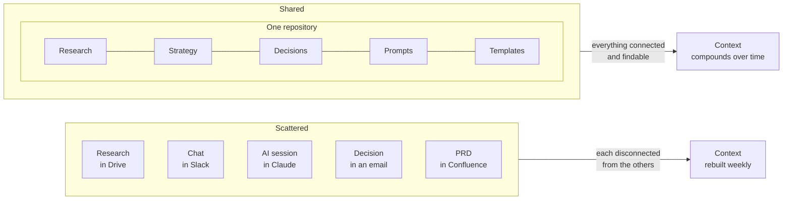
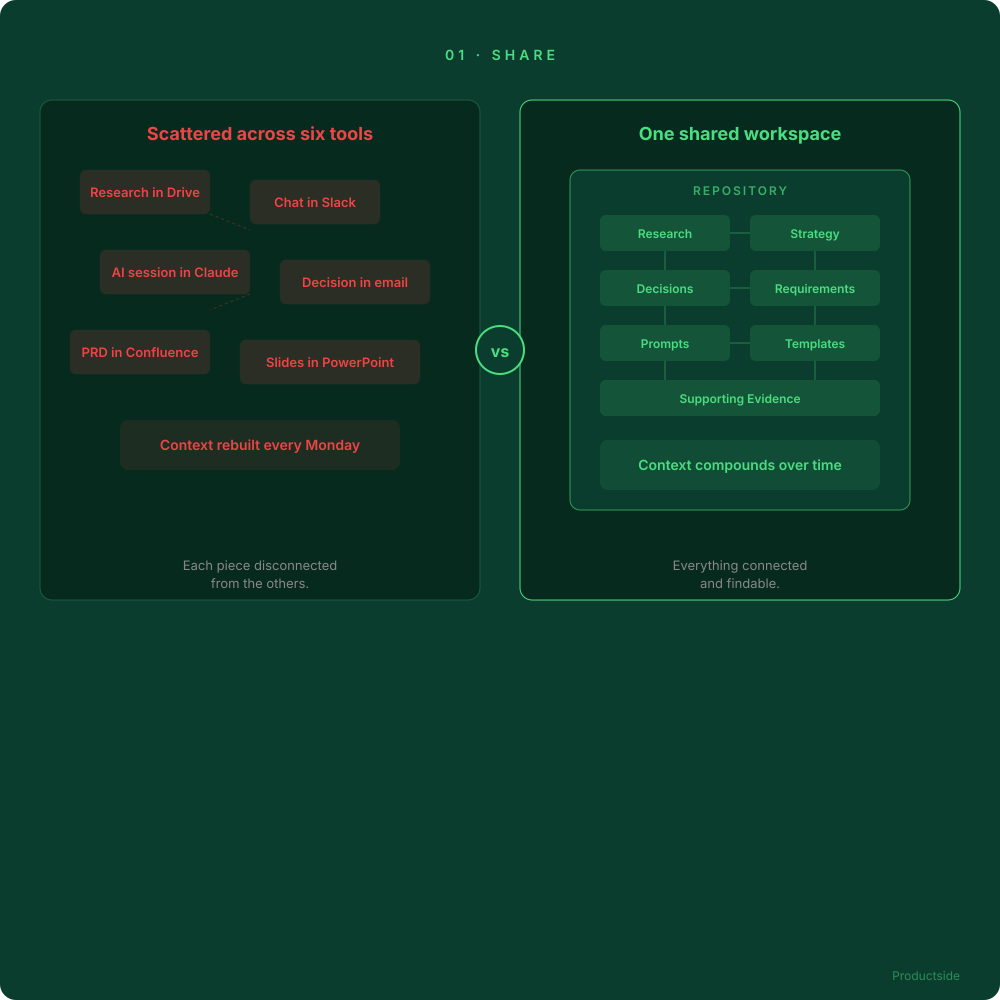

<svg xmlns="http://www.w3.org/2000/svg" viewBox="0 0 960 160" width="960" height="160">
  <rect width="960" height="160" rx="12" fill="#0B3D2E"/>
  <text x="48" y="58" font-family="system-ui, -apple-system, sans-serif" font-size="16" font-weight="600" letter-spacing="3" fill="#4ADE80" text-anchor="start">01 · SHARE</text>
  <text x="48" y="108" font-family="system-ui, -apple-system, sans-serif" font-size="48" font-weight="700" fill="#FFFFFF" text-anchor="start">Share a complete</text>
  <text x="48" y="148" font-family="system-ui, -apple-system, sans-serif" font-size="48" font-weight="700" fill="#FFFFFF" text-anchor="start">product workspace</text>
  <circle cx="900" cy="80" r="36" fill="none" stroke="#4ADE80" stroke-width="2"/>
  <text x="900" y="88" font-family="system-ui, -apple-system, sans-serif" font-size="28" font-weight="700" fill="#4ADE80" text-anchor="middle">01</text>
</svg>

&nbsp;

## The difference

Your VP asks on Tuesday why the team dropped a feature last quarter. You spend the afternoon searching six tools to reconstruct your own rationale. That scavenger hunt is the cost of scattered context.

&nbsp;

&nbsp;

Research, strategy, decisions, requirements, prompts, templates, and supporting evidence live together. Not in a folder. In a workspace where every piece knows its relationship to every other piece.

In plain English: the whole team stops re-explaining the product to each other and to their tools.

&nbsp;

---

Beyond the Backlog · Productside · September 2, 2026

---

[&larr; The frame](03_the-frame.md) · [Next: Collaborate &rarr;](05_collaborate.md) · [Run](run.md)
