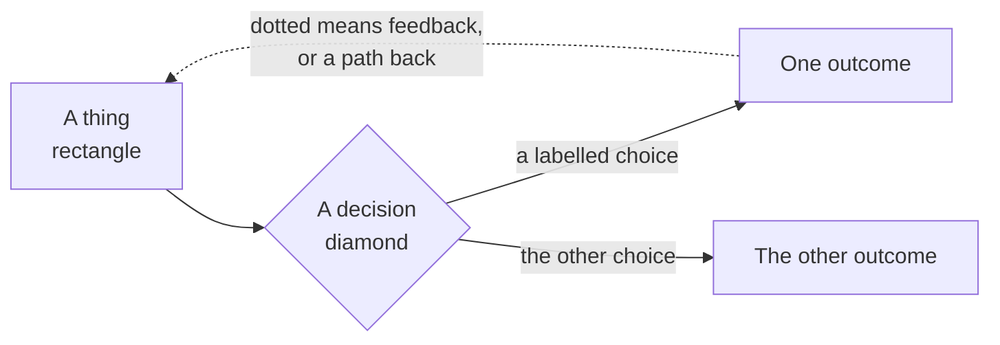
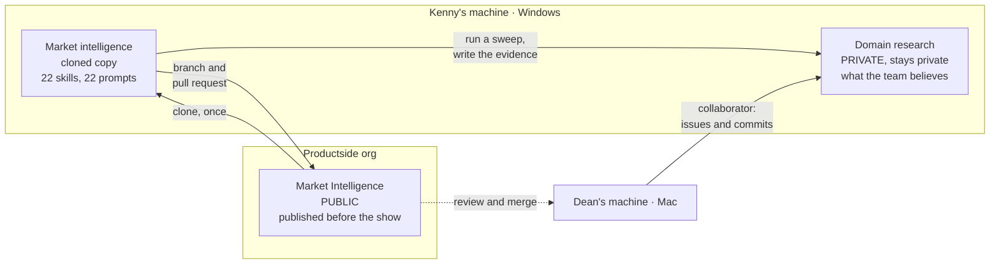

<svg xmlns="http://www.w3.org/2000/svg" viewBox="0 0 960 160" width="960" height="160">
  <rect width="960" height="160" rx="12" fill="#0B3D2E"/>
  <text x="48" y="58" font-family="system-ui, -apple-system, sans-serif" font-size="16" font-weight="600" letter-spacing="3" fill="#4ADE80" text-anchor="start">THE FRAME</text>
  <text x="48" y="108" font-family="system-ui, -apple-system, sans-serif" font-size="44" font-weight="700" fill="#FFFFFF" text-anchor="start">Today's build</text>
  <text x="48" y="138" font-family="system-ui, -apple-system, sans-serif" font-size="16" fill="#94D2BD" text-anchor="start">Beyond the Backlog · Productside</text>
</svg>

&nbsp;

## The notation

Every diagram in this session uses the same four marks.

- **Rectangle** — a thing that exists: a file, a repo, a person, a state.
- **Diamond** — a decision or a check. Something evaluates and routes.
- **Solid arrow** — the forward path. What normally happens next.
- **Dotted arrow** — a return: feedback, a loop, a fallback.

&nbsp;

## Two repos, two jobs

Kenny's work never leaves private.

&nbsp;

---

Beyond the Backlog: Five GitHub Plays for Product Teams · Productside · September 2, 2026

---

[&larr; How we got here](03_how-we-got-here.md) · [Next: Play 1 &rarr;](05_play-1-context.md) · [Run](run.md)
