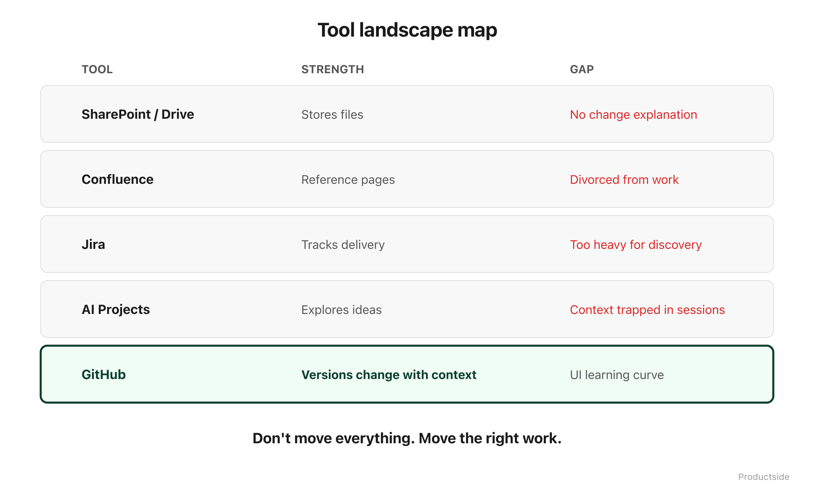

<svg xmlns="http://www.w3.org/2000/svg" viewBox="0 0 960 160" width="960" height="160">
  <rect width="960" height="160" rx="12" fill="#1a1a1a"/>
  <text x="48" y="58" font-family="system-ui, -apple-system, sans-serif" font-size="16" font-weight="600" letter-spacing="3" fill="#94D2BD" text-anchor="start">TOOL FIT</text>
  <text x="48" y="108" font-family="system-ui, -apple-system, sans-serif" font-size="48" font-weight="700" fill="#FFFFFF" text-anchor="start">Not better.</text>
  <text x="48" y="148" font-family="system-ui, -apple-system, sans-serif" font-size="48" font-weight="700" fill="#FFFFFF" text-anchor="start">Different.</text>
  <text x="912" y="140" font-family="system-ui, -apple-system, sans-serif" font-size="14" fill="#94D2BD" text-anchor="end">Productside</text>
</svg>

&nbsp;

## Tool Fit

The question is not "should we replace our tools with GitHub?" The question is: what work does each tool actually support, and where are the gaps?

&nbsp;

&nbsp;

Every tool earns its place by doing one thing well. The problem is not that your tools are bad. The problem is that none of them were built to version change over time.

**Google Docs and Confluence store documents.** They are good at that. But a document that was edited six times does not show you what changed between edit three and edit five unless someone thought to leave a comment.

**Jira tracks delivery.** Tickets, sprints, velocity. It is purpose-built for the "what are we building this sprint" question. It is not built for "how did our strategy evolve over the last quarter."

**Slack talks.** It is excellent at real-time coordination. It is terrible at preserving decisions. A decision made in Slack is discoverable for about 72 hours.

**AI project tools isolate.** ChatGPT, Claude projects, Copilot workspaces: each gives you a private sandbox. Useful for individual work. But the context stays with one person.

**GitHub versions change.** That is its native capability. Every edit, every review, every merge is a recorded event with attribution and history.

In plain English: you already have tools that store, track, talk, and generate. What you may not have is a tool that remembers how your product thinking evolved. That is the gap GitHub fills.

> **"Don't move everything. Move the right work."**

&nbsp;

---

Beyond the Backlog · Productside · September 2, 2026

---

[← Previous](03_the-shift.md) · [Next: Seven Capabilities →](05_seven-capabilities.md) · [Run](run.md)
