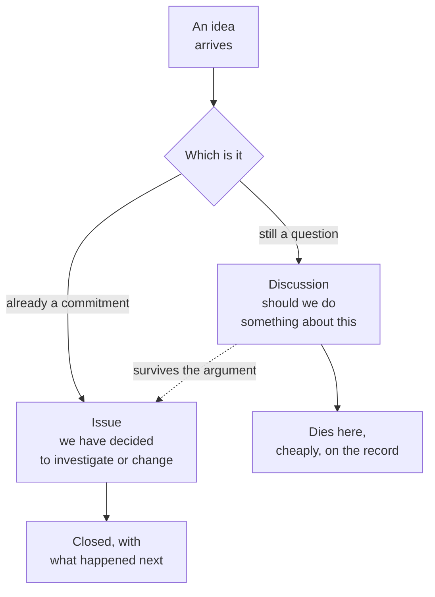

<svg xmlns="http://www.w3.org/2000/svg" viewBox="0 0 960 160" width="960" height="160">
  <rect width="960" height="160" rx="12" fill="#0B3D2E"/>
  <text x="48" y="58" font-family="system-ui, -apple-system, sans-serif" font-size="16" font-weight="600" letter-spacing="3" fill="#4ADE80" text-anchor="start">02 · COLLABORATE</text>
  <text x="48" y="108" font-family="system-ui, -apple-system, sans-serif" font-size="48" font-weight="700" fill="#FFFFFF" text-anchor="start">Work together without</text>
  <text x="48" y="148" font-family="system-ui, -apple-system, sans-serif" font-size="48" font-weight="700" fill="#FFFFFF" text-anchor="start">trampling each other</text>
  <circle cx="900" cy="80" r="36" fill="none" stroke="#4ADE80" stroke-width="2"/>
  <text x="900" y="88" font-family="system-ui, -apple-system, sans-serif" font-size="28" font-weight="700" fill="#4ADE80" text-anchor="middle">02</text>
</svg>

&nbsp;

## The fork most teams have no home for

Your team has an idea. Right now it lives in Slack, dies in a thread, and six months later someone proposes the same thing again. The question: is this still open, or have we already decided?

&nbsp;

Discussions hold the questions. Issues hold the commitments. Both are attached to the work itself, not floating in a chat feed or buried in an inbox.

In plain English: the team can challenge, debate, and build on each other's thinking without every conversation needing to become a formal ticket.

> **"Arguing in a Discussion costs nothing. Arguing in a roadmap costs a quarter."**

&nbsp;

---

Beyond the Backlog · Productside · September 2, 2026

---

[&larr; Share](04_share.md) · [Next: Review &rarr;](06_review.md) · [Run](run.md)
