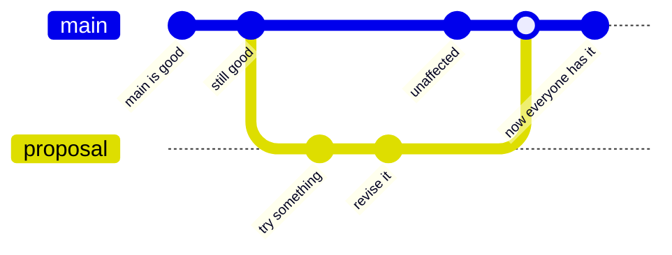
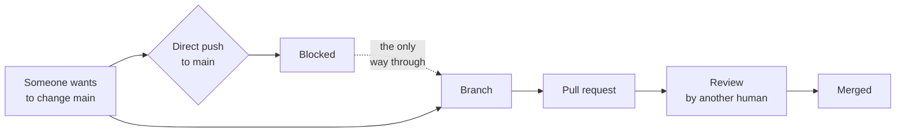

<svg xmlns="http://www.w3.org/2000/svg" viewBox="0 0 960 160" width="960" height="160"><rect width="960" height="160" rx="12" fill="#1a1a1a"/><text x="48" y="100" font-family="system-ui, -apple-system, sans-serif" font-size="44" font-weight="800" fill="#FFFFFF" text-anchor="start">Collaborative Commits</text></svg>

## WF6: Commit the Change with the Reasoning

A commit is a labeled checkpoint of your work and your reasoning. This distinction matters more than most people realize. "Updated file" as a commit message tells you nothing. Six months from now, when someone asks why the battle card changed, "Updated file" is the equivalent of a shrug. "Improve battle card for seller usability: add win themes, objection handling, and one-page summary" tells you everything. It tells you what changed, why it changed, and what the change was intended to accomplish.

In plain English: when you commit, you are not just saving your work. You are writing a note to your future self and your future teammates explaining what you did and why you did it. The AI drafts this note for you based on the actual changes it can see in the files. You review it, adjust it if needed, and confirm. The commit goes onto your branch, not onto main. The team's trusted version is still untouched.

This is the moment where the work becomes durable. Before the commit, your changes exist only on your local machine. After the commit, they are recorded in the repository's history with your name, the date, and the reasoning. If your laptop dies tomorrow, the commit survives. If someone wants to understand the change next year, the commit message is the first thing they read.

> **AI Prompt**
>
> "Show me exactly what changed in the Battle Card skill on my branch and summarize the important differences. Then commit those changes with a concise message that captures both what changed and why we changed it. Do not merge anything into main."

### Invisible Machinery

```
git status                    # What files changed?
git diff                      # What exactly is different?
git add -A                    # Stage all changes for commit
git commit -m "Improve battle card for seller usability

Add Thirty-Second Read seller summary, elevate TCO/velocity/data gravity
as win themes, add objection-handling responses, strip jargon.
Preserves all evidence and sourcing from original."
```

The AI runs `git status` to see which files changed, then `git diff` to see the exact line-by-line differences. It drafts a commit message that summarizes both the what and the why. The message has two parts: a short headline and a longer description. The headline appears in the log. The description appears when someone clicks into the commit for detail. Both are written by the AI, reviewed by Kenny, and committed with Kenny's identity.



This diagram shows the timeline. Main has its own commits, unaffected by the branch. The branch has its own commits, safe to revise and rework. When the branch is ready and reviewed, it merges back into main. The merge commit is the point where the team's trusted version absorbs the improvement. Until that merge happens, the two timelines are independent.

## WF7: Test the Change, Then Push the PR

The commit is local. It exists on Kenny's machine and nowhere else. For the team to see it, review it, and discuss it, the branch needs to be pushed to GitHub and a pull request needs to be opened.

A pull request is exactly what it sounds like: a request to pull your changes into the team's trusted version. It is not an automatic merge. It is a conversation. The pull request shows everyone what changed, why, and what the test demonstrated. Reviewers can comment on specific lines. They can ask questions. They can request changes. The merge only happens when someone with the authority to approve it says "this is ready."

But before pushing, Kenny runs the updated skill to verify the improvement. This is the test: does the new version of the battle card actually produce better output than the old one? The AI runs both versions, compares them, and summarizes the differences. If the new version is genuinely better, the AI commits the final result, pushes the branch, and opens the pull request.

> **AI Prompt**
>
> "Run the updated Battle Card skill on my improve-battle-card branch. Compare it with the previous output. If the changes improve seller usability, commit the final edits, push the branch, and open a pull request for team review. Summarize what changed, why, and what the test showed. Do not merge to main."

### Invisible Machinery

```
# Run the skill and compare output
# (AI executes the battle card skill, diffs against previous output)

# If improved, commit and push
git add -A
git commit -m "Test updated battle card: seller usability improved

Compared new output against original. Thirty-Second Read is concise and
seller-focused. Win themes prominent. Objection handling covers top three
competitor claims. Jargon reduced throughout."

git push -u origin improve-battle-card

# Open the pull request
gh pr create --fill
```

The `git push -u origin improve-battle-card` command sends the branch to GitHub. The `-u` flag sets up tracking so future pushes are simpler. The `gh pr create --fill` command opens a pull request and auto-fills the title and description from the commit messages. The pull request is now visible to every team member with access to the repository.



This diagram shows the guardrail. In a well-configured repository, direct pushes to main are blocked. That is not a limitation; it is the safety mechanism. The only way to change what the team trusts is to go through a branch, a pull request, and a review. This means every change to main has been seen by at least two people: the person who made it and the person who reviewed it.

The obvious concern is: could this slow things down? Yes, if the review process is heavy. No, if the team treats pull requests the way they are intended: a quick read of what changed and why, a thumbs-up or a question, and a merge. For a battle card improvement, the review should take minutes, not days. The cost of the review is tiny compared to the cost of shipping a bad change to the version everyone trusts.

### Adoption and Limits

**Use this when** the change deserves a record and a conversation. Any change that affects how the team thinks about the product, the market, or the competition. Any change that other people will rely on.

**Skip it when** the change is non-controversial and does not benefit from review. Updating a date, fixing a typo, adding a link. These can go straight to main if the repository allows it.

**What it does not do:** It does not create reasoning for you. The AI writes a commit message, but the reasoning is yours. If you do not have a clear reason for the change, the commit message will be vague and the pull request will be confusing. The tool amplifies your thinking; it does not replace it.

---

&larr; [Collaborative Improvements](04_collaborative-improvements.md) &middot; Next &rarr; [Collaborative Reuse](06_collaborative-reuse.md) &middot; [Run](run.md)

Beyond the Backlog &middot; Productside &middot; September 2, 2026
