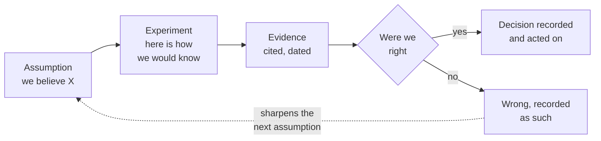

<svg xmlns="http://www.w3.org/2000/svg" viewBox="0 0 960 160" width="960" height="160">
  <rect width="960" height="160" rx="12" fill="#0B3D2E"/>
  <text x="48" y="58" font-family="system-ui, -apple-system, sans-serif" font-size="16" font-weight="600" letter-spacing="3" fill="#4ADE80" text-anchor="start">PLAY 03</text>
  <text x="48" y="108" font-family="system-ui, -apple-system, sans-serif" font-size="48" font-weight="700" fill="#FFFFFF" text-anchor="start">Confidence</text>
  <text x="48" y="138" font-family="system-ui, -apple-system, sans-serif" font-size="16" fill="#94D2BD" text-anchor="start">Beyond the Backlog · Productside</text>
  <circle cx="900" cy="80" r="36" fill="none" stroke="#4ADE80" stroke-width="2"/>
  <text x="900" y="88" font-family="system-ui, -apple-system, sans-serif" font-size="28" font-weight="700" fill="#4ADE80" text-anchor="middle">03</text>
</svg>

&nbsp;

## Evidence

From assumption to decision, connected. The one most teams cannot do: a finding that says "we were wrong" is only valuable if it is findable later.

&nbsp;

> **"Stars are not market share. Issue volume is not pain severity."**

&nbsp;

---

Beyond the Backlog: Five GitHub Plays for Product Teams · Productside · September 2, 2026

---

[&larr; Play 2](04_play-2-communications.md) · [Next: Play 4 &rarr;](06_play-4-constitution.md) · [Run](run.md)
