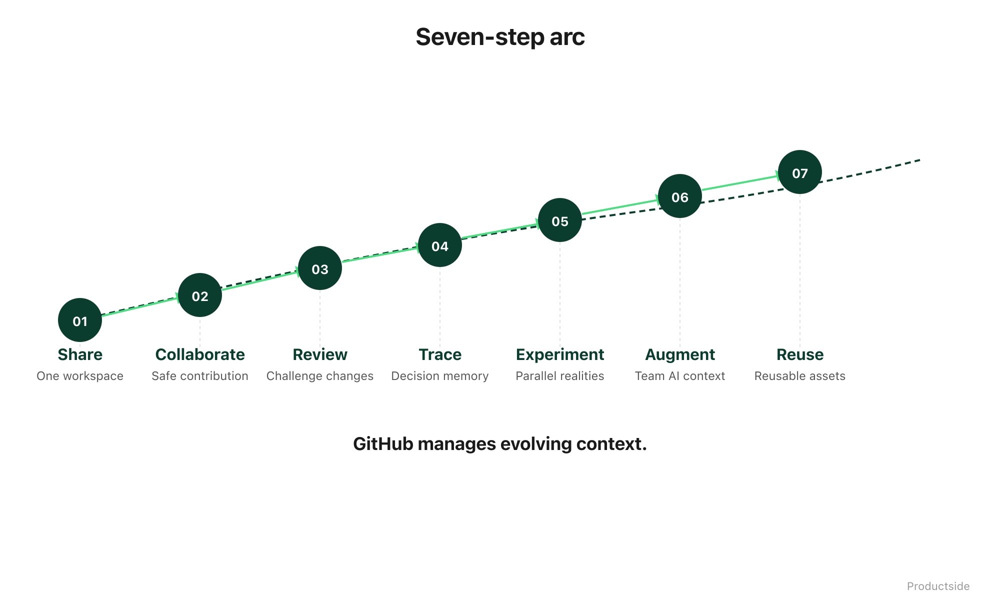

<svg xmlns="http://www.w3.org/2000/svg" viewBox="0 0 960 160" width="960" height="160">
  <rect width="960" height="160" rx="12" fill="#1a1a1a"/>
  <text x="48" y="58" font-family="system-ui, -apple-system, sans-serif" font-size="16" font-weight="600" letter-spacing="3" fill="#94D2BD" text-anchor="start">SEVEN CAPABILITIES</text>
  <text x="48" y="108" font-family="system-ui, -apple-system, sans-serif" font-size="42" font-weight="700" fill="#FFFFFF" text-anchor="start">Share · Collaborate · Review</text>
  <text x="48" y="148" font-family="system-ui, -apple-system, sans-serif" font-size="42" font-weight="700" fill="#FFFFFF" text-anchor="start">Trace · Experiment · Augment · Reuse</text>
  <text x="912" y="140" font-family="system-ui, -apple-system, sans-serif" font-size="14" fill="#94D2BD" text-anchor="end">Productside</text>
</svg>

&nbsp;

## Seven Capabilities

This is the spine of how GitHub serves product teams. Seven capabilities, each one building on the last, each one answering a specific product management problem.

&nbsp;

&nbsp;

These are not features of GitHub. They are capabilities that emerge when you use GitHub as a product workspace. The distinction matters: a feature is something you click. A capability is something your team gains.

**Share** gives you a complete workspace. One place where strategy, research, requirements, prompts, and templates live together with shared visibility.

**Collaborate** gives you safe contribution. Anyone on the team can propose a change without risking the current version.

**Review** gives you reviewable changes. Strategy does not mutate silently. Someone looks at it, challenges it, and approves it before it becomes the version of record.

**Trace** gives you decision memory. Who changed it, what changed, and why. Not because someone remembered to document it, but because the tool records it automatically.

**Experiment** gives you parallel exploration. Try two approaches at once without corrupting the trusted version.

**Augment** gives you AI-ready reuse. When your AI tools can read the repo, they start with team context instead of a blank slate.

**Reuse** gives you compounding leverage. Templates, prompts, playbooks, and operating models that travel from one product to the next.

> **"GitHub manages evolving context, not just files."**

&nbsp;

---

Beyond the Backlog · Productside · September 2, 2026

---

[← Previous](04_tool-fit.md) · [Next: 01 · Share →](06_share.md) · [Run](run.md)
