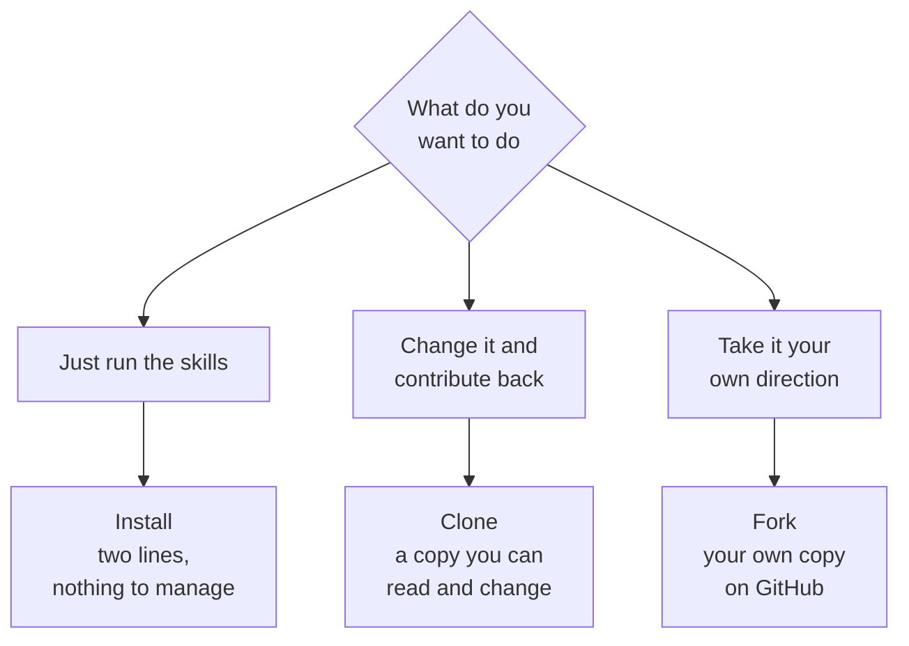

<svg xmlns="http://www.w3.org/2000/svg" viewBox="0 0 960 160" width="960" height="160"><rect width="960" height="160" rx="12" fill="#1a1a1a"/><text x="48" y="100" font-family="system-ui, -apple-system, sans-serif" font-size="44" font-weight="800" fill="#FFFFFF" text-anchor="start">Collaborative Reuse</text></svg>

## WF8: Review the PR. Merge the Winner.

Dean switches to his screen. This is the review step, the moment where one person's improvement becomes the team's shared truth. The pull request is open. The diff is visible. The test results are summarized. Now a second pair of eyes reads through what changed and decides: is this better?

In plain English: the branch is a proposal. The merge makes it shared truth. Until Dean reviews and approves, Kenny's changes live on their own branch. Main is untouched. The team's trusted version has not moved. This is the guardrail that makes the whole model work: you can be ambitious on a branch because someone else checks the result before it reaches everyone.

> **AI Prompt (Dean's machine)**
>
> "Review the open improve-battle-card pull request. Show me what changed, why, and what the test demonstrated. Flag any concerns or reviewer comments. If everything checks out, help me approve and merge it into main."

### Invisible Machinery

```
gh pr review --approve
gh pr merge
```

Two commands. The first records Dean's approval. The second merges the branch into main. The pull request closes automatically. The branch can be deleted. Main now contains Kenny's improvement, with the full history of what changed, why, and who reviewed it.

And here is the closing image of the live demo: Kenny's name on a commit in a public repository. Not one git command typed. Not one terminal window opened. Kenny said sentences to an AI assistant, and the assistant handled every mechanical step. The thinking was Kenny's. The execution was automated. The result is permanent, attributed, and reviewable.

### Failure Recovery

The live demo has contingencies for each failure mode:

**If the PR will not open:** Kenny's push might fail due to permissions or network issues. Dean pushes the branch from his side and opens the PR manually. The teaching point is the same; the route is slightly different.

**If the content guard goes red:** This is actually the best failure. A guard catching something on camera is worth more than a green tick. Dean reads the error aloud and explains what the guard caught: maybe a formatting issue, maybe a reference that needs updating, maybe a term that should not appear in the output. The audience sees the safety net working in real time. This builds more trust than a clean run.

**If there is a merge conflict:** Dean does not resolve it live. He says "I'll take this one" and moves on to the teaching point. Merge conflicts are a real part of collaboration, but resolving one on camera is a distraction from the story.

## Team Reuse: Before and After

The improvement Kenny made is not just a better battle card. It is a better battle card skill. Every time anyone on the team runs that skill from now on, they get the improved version. This is the compounding effect the opening section promised.

**Before:** Knowledge is trapped in heads. "My template" lives on my laptop. "My prompt" is in my chat history. If I leave the team, my templates and prompts leave with me. If someone else wants to run a similar analysis, they start from scratch or ask me to share a file over Slack. There is no review, no version history, no record of how the template evolved.

**After:** The template is a versioned, shared, reviewable, improvable asset. It lives in the repository. Anyone on the team can run it. Anyone can propose an improvement. Every improvement goes through a branch and a review. The history shows who changed what and why. When someone new joins the team, they clone the repository and have access to every skill the team has built, with the reasoning behind every change.

This is not a theoretical benefit. It is the difference between a team that rebuilds its tools every quarter and a team whose tools get better every quarter.

## Project Reuse: The Contribution Loop

Not everyone who uses a shared library wants to contribute back. That is fine. GitHub gives you three levels of engagement, and each one is appropriate for a different situation.



**Install** is the lightest touch. Two lines of setup and you can run the skills. You do not manage the repository. When the library updates, you pull the new version. This is for teams that want to use the tools without maintaining them.

**Clone** is what Kenny did in this demo. You have a full copy of the repository on your machine. You can read every file, change anything you want, and contribute improvements back through pull requests. This is for teams that want to both use and improve the shared library.

**Fork** is the most independent option. You create your own copy of the repository on GitHub, under your own account. You can take it in a completely different direction. You can still pull updates from the original if you want, but you are not obligated to. This is for teams that want to build something new on top of the existing foundation.

The contribution loop is what makes open-source work, and it works the same way for product teams. Someone publishes a useful library. Other teams install it. Some of those teams improve it and contribute back. The library gets better for everyone. This is compounding at the organizational level, not just the team level.

## Community Reuse: Five Public Repos Worth Studying

GitHub is not just where you store your work. It is also where you study how other teams think. These five public repositories demonstrate different approaches to product work on GitHub. Each one is worth browsing.

**PM Operating System** -- [deanpeters/Product-Manager-Skills](https://github.com/deanpeters/Product-Manager-Skills)
A collection of product management skills and frameworks organized as AI-ready prompts. Shows how to structure a skills library that an AI assistant can read and execute. Worth studying for the organizational pattern: each skill is a self-contained file with a clear purpose, inputs, and outputs.

**Product Knowledge Corpus** -- [ChatPRD/lennys-podcast-transcripts](https://github.com/ChatPRD/lennys-podcast-transcripts)
A curated collection of product management podcast transcripts, structured for AI consumption. Demonstrates how to turn unstructured content into a searchable, referenceable knowledge base. The value is not the transcripts themselves; it is the structure that makes them useful.

**Synthetic Research** -- [microsoft/TinyTroupe](https://github.com/microsoft/TinyTroupe)
Microsoft's framework for simulating user personas to test product ideas before building them. Shows how to use AI to generate synthetic research data: simulated user interviews, usage patterns, and preference testing. Worth studying for the methodology, not just the tooling.

**Evals Method** -- [hamelsmu/evals-skills](https://github.com/hamelsmu/evals-skills)
A practical framework for evaluating AI outputs systematically. Demonstrates how to build evaluation criteria, run tests, and track quality over time. Relevant for any team using AI to generate content that needs to meet a quality bar.

**Vibe Prototyping** -- [KhazP/vibe-coding-prompt-template](https://github.com/KhazP/vibe-coding-prompt-template)
A template for turning product ideas into working prototypes through structured AI prompts. Shows the "vibe coding" approach: describe what you want in natural language, and the AI generates a functional prototype. Worth studying for how the prompt structure shapes the output quality.

Each of these repositories is a window into how someone else thinks about a problem. The files are public. The commit history is public. The discussions and pull requests are public. You can see not just what they built, but how they built it, what they changed along the way, and why.

### Adoption and Limits

**Use this when** the team needs to see what changed and discuss it before it becomes the shared version. Any change to positioning, competitive analysis, research findings, or team workflows benefits from a review conversation.

**Skip it when** you are the only reader and the work is not shared. A personal analysis that nobody else will reference does not need the overhead of a pull request and review cycle.

**What it does not do:** It does not substitute for domain expertise. The reviewer needs enough context to challenge the change. If the only person who understands the competitive landscape is the person who wrote the battle card, the review step is a rubber stamp, not a safeguard. Build a team where at least two people can meaningfully review any critical document.

---

&larr; [Collaborative Commits](05_collaborative-commits.md) &middot; Next &rarr; [Collaborative Governance](07_collaborative-governance.md) &middot; [Run](run.md)

Beyond the Backlog &middot; Productside &middot; September 2, 2026
