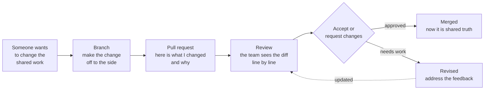
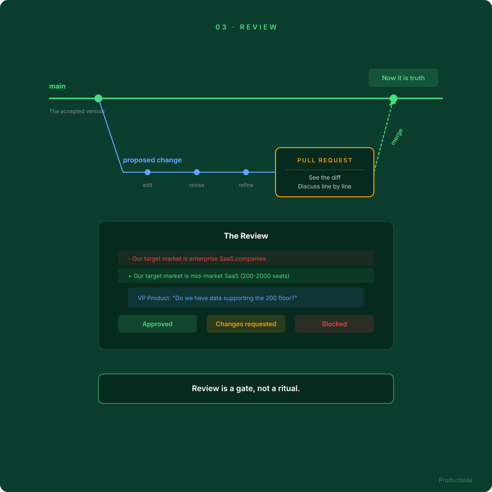

<svg xmlns="http://www.w3.org/2000/svg" viewBox="0 0 960 160" width="960" height="160">
  <rect width="960" height="160" rx="12" fill="#0B3D2E"/>
  <text x="48" y="58" font-family="system-ui, -apple-system, sans-serif" font-size="16" font-weight="600" letter-spacing="3" fill="#4ADE80" text-anchor="start">03 · REVIEW</text>
  <text x="48" y="108" font-family="system-ui, -apple-system, sans-serif" font-size="48" font-weight="700" fill="#FFFFFF" text-anchor="start">Make changes reviewable</text>
  <text x="48" y="148" font-family="system-ui, -apple-system, sans-serif" font-size="48" font-weight="700" fill="#FFFFFF" text-anchor="start">before they become truth</text>
  <circle cx="900" cy="80" r="36" fill="none" stroke="#4ADE80" stroke-width="2"/>
  <text x="900" y="88" font-family="system-ui, -apple-system, sans-serif" font-size="28" font-weight="700" fill="#4ADE80" text-anchor="middle">03</text>
</svg>

&nbsp;

## The pull request

Every PM has had this experience: someone edits the strategy doc, nobody notices, and three weeks later the team is executing against a version nobody agreed to. The pull request turns a proposed change into an explicit object for discussion.

&nbsp;

This is the single most interesting difference between a repository and ordinary document editing. A proposed change to your strategy, positioning, requirements, a product bet, a prompt, or an operating practice becomes something the team can see, discuss, and approve before it becomes the accepted version.

In plain English: nobody quietly overwrites the strategy while you are on PTO.

> **"Review is a gate, not a ritual. The difference is whether you can push straight to main."**

&nbsp;

---

Beyond the Backlog · Productside · September 2, 2026

---

[&larr; Collaborate](05_collaborate.md) · [Next: Trace &rarr;](07_trace.md) · [Run](run.md)
