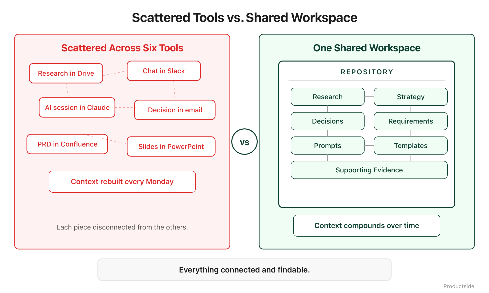

<svg xmlns="http://www.w3.org/2000/svg" viewBox="0 0 960 160" width="960" height="160">
  <rect width="960" height="160" rx="12" fill="#0B3D2E"/>
  <text x="48" y="58" font-family="system-ui, -apple-system, sans-serif" font-size="16" font-weight="600" letter-spacing="3" fill="#4ADE80" text-anchor="start">01 · SHARE</text>
  <text x="48" y="108" font-family="system-ui, -apple-system, sans-serif" font-size="48" font-weight="700" fill="#FFFFFF" text-anchor="start">One product</text>
  <text x="48" y="148" font-family="system-ui, -apple-system, sans-serif" font-size="48" font-weight="700" fill="#FFFFFF" text-anchor="start">workspace.</text>
  <circle cx="900" cy="80" r="36" fill="none" stroke="#4ADE80" stroke-width="2"/>
  <text x="900" y="88" font-family="system-ui, -apple-system, sans-serif" font-size="28" font-weight="700" fill="#4ADE80" text-anchor="middle">01</text>
</svg>

&nbsp;

## 01 · Share

Stop rebuilding context from fragments. A product repo gives your team one place where the artifacts that define the product live together, visible to everyone who needs them.

&nbsp;

&nbsp;

This is the foundation. Before you can collaborate, review, trace, or reuse anything, the work has to live somewhere everyone can see it.

**Strategy.** Your vision document, your positioning statement, your competitive landscape. Not in someone's personal drive. In the repo.

**Research.** Customer interviews, survey results, market analysis. Findable. Browsable. Not buried in an email attachment from four months ago.

**Decisions.** When the team chose to cut a feature, or pivot on pricing, or target a different segment. Recorded where the next person to ask "why did we do that?" will actually find the answer.

**Requirements.** The PRD, the user stories, the acceptance criteria. One version. The version.

**Prompts.** The AI prompts your team uses to generate competitive analyses, draft positioning, or evaluate feature requests. Shared, not private.

**Templates.** The formats, checklists, and frameworks your team reuses. Available to everyone, not just the person who built them.

The obvious concern is: could we accidentally expose something sensitive? Yes, if we were sloppy. Which is why the repo is private by default, access is controlled at the organization level, and sensitive material has its own guardrails.

> **"Shared context compounds. Private context evaporates."**

&nbsp;

**Adoption and limits**

- *Use this when* your team wastes time hunting for the latest version of product artifacts, or when new team members take weeks to find everything they need.
- *Skip it when* your product work is genuinely single-person and will stay that way.
- *What it does not do:* sharing alone does not give you review, history, or collaboration. Those are the next capabilities.

&nbsp;

---

Beyond the Backlog · Productside · September 2, 2026

---

[← Previous](05_seven-capabilities.md) · [Next: 02 · Collaborate →](07_collaborate.md) · [Run](run.md)
