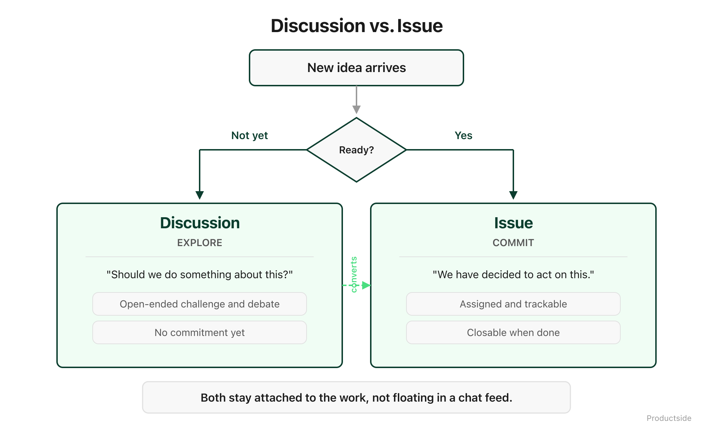

<svg xmlns="http://www.w3.org/2000/svg" viewBox="0 0 960 160" width="960" height="160">
  <rect width="960" height="160" rx="12" fill="#0B3D2E"/>
  <text x="48" y="58" font-family="system-ui, -apple-system, sans-serif" font-size="16" font-weight="600" letter-spacing="3" fill="#4ADE80" text-anchor="start">02 · COLLABORATE</text>
  <text x="48" y="108" font-family="system-ui, -apple-system, sans-serif" font-size="48" font-weight="700" fill="#FFFFFF" text-anchor="start">Work together without</text>
  <text x="48" y="148" font-family="system-ui, -apple-system, sans-serif" font-size="48" font-weight="700" fill="#FFFFFF" text-anchor="start">trampling.</text>
  <circle cx="900" cy="80" r="36" fill="none" stroke="#4ADE80" stroke-width="2"/>
  <text x="900" y="88" font-family="system-ui, -apple-system, sans-serif" font-size="28" font-weight="700" fill="#4ADE80" text-anchor="middle">02</text>
</svg>

&nbsp;

## 02 · Collaborate

Contribution should not create chaos. GitHub gives every contributor a way to propose changes without touching the version everyone else is relying on.

&nbsp;

&nbsp;

Here is what collaboration looks like in most product teams today: someone edits the strategy doc, someone else edits a different copy, and by Thursday you have three versions with no clear winner. The problem is not that people contributed. The problem is that the tool let them overwrite each other.

**Propose changes.** A team member creates a branch, makes their edits, and submits a pull request. The original stays untouched until the change is reviewed and approved. Nobody's work gets overwritten by surprise.

**Discuss near the work.** Comments happen on the pull request, right next to the lines that changed. Not in a Slack thread that will scroll off the screen by Monday. Not in a meeting that three people missed.

**Reconcile edits.** When two people change the same section, the tool surfaces the conflict instead of silently picking a winner. You see both versions and decide which one stays.

**Keep the baseline clean.** The main branch is the trusted version. Changes arrive through pull requests. This is not bureaucracy. This is the same idea as "don't edit the signed contract, propose an amendment."

In plain English: collaboration gets structure. Not gates. Not approval chains. Structure. The kind that means your Monday morning is "review three proposed changes" instead of "figure out which version of the doc is real."

> **"Collaboration gets structure, not bureaucracy."**

&nbsp;

**Adoption and limits**

- *Use this when* multiple people contribute to the same product artifacts and you have had at least one "which version is current?" conversation this quarter.
- *Skip it when* you are a solo PM with no contributors. Share (capability 01) is enough.
- *What it does not do:* collaboration does not enforce quality. That is what Review does next.

&nbsp;

---

Beyond the Backlog · Productside · September 2, 2026

---

[← Previous](06_share.md) · [Next: 03 · Review →](08_review.md) · [Run](run.md)
