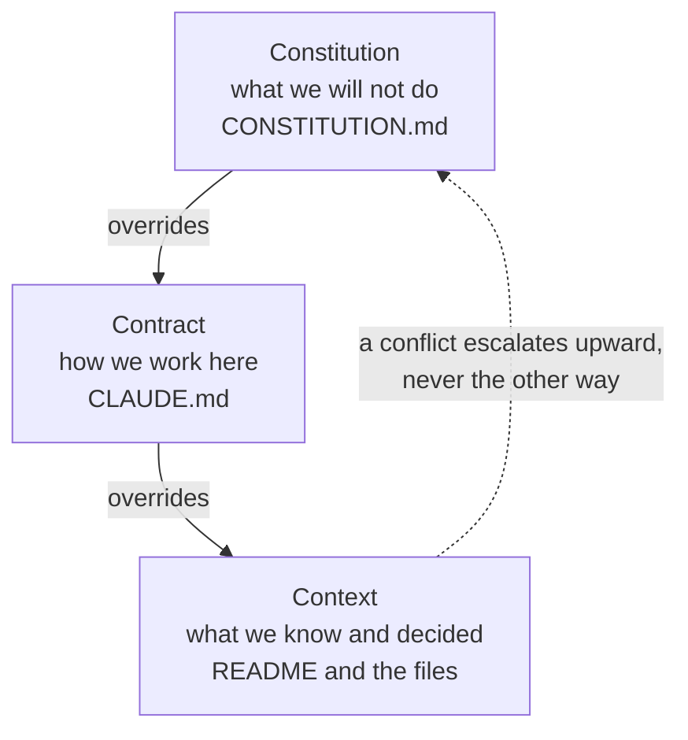

<svg xmlns="http://www.w3.org/2000/svg" viewBox="0 0 960 160" width="960" height="160"><rect width="960" height="160" rx="12" fill="#1a1a1a"/><text x="48" y="100" font-family="system-ui, -apple-system, sans-serif" font-size="44" font-weight="800" fill="#FFFFFF" text-anchor="start">Collaborative Governance</text></svg>

## Legal Governance — "Yes, Talk to Them and Your COO"

Everything shown so far — the shared context, the structured decisions, the AI that reads the repo — assumes you have the right to share what you are sharing. That assumption is worth examining before you flip a repository from private to public, and frankly before you commit certain things even to a private one. Five pillars hold the governance story up. Skip any one, and the structure wobbles.

### 1. License

Not everything needs a software license. If you publish teaching materials, frameworks, or templates, a Creative Commons license may be the better fit. Productside uses CC BY-NC-ND 4.0 for its published materials — that is a deliberate choice, not a leftover default. It says: you can read this, share it, and learn from it, but you cannot repackage it for sale or alter it and pass off the result as your own.

The decision about which license to use is a business decision, not a technical one. It belongs to whoever owns the intellectual property, not whoever sets up the repository. If you are unsure, that is a signal to ask, not a signal to pick MIT and move on.

In plain English: the license file is a contract with everyone who will ever read your repository. Write it on purpose.

### 2. Vocabulary

Your words shape how buyers and procurement departments interpret the work. Say *materials*, *templates*, and *methods* when that is what they are. The moment you call something "software," you invite software security questionnaires and warranty terms onto what may be a training agreement.

This is not hypothetical. Productside learned it the hard way. When a counterparty's legal team searches your public repository and finds the word "application" in a README, they treat you as a software vendor — and a software vendor's liability profile is a very different conversation from a training firm's.

In plain English: the vocabulary rule is not about politeness. It is about what contract terms you trigger by how you describe your own work.

### 3. Publishing

Going public is a go-to-market decision, not just a repository setting. The toggle between private and public on GitHub is one click. The question behind that click is not "can we flip it public?" It is "what happens when someone we have never met reads everything in here?"

That question surfaces content you forgot about: an offhand comment in a commit message, a document that mentions a client by name, a draft that overpromises a feature. The review before publishing is not paranoia. It is marketing discipline applied to a new channel.

In plain English: treat the public switch the way you treat a press release. Someone is going to read it who you did not invite.

### 4. Ownership

Know what IP is yours to share and what belongs to a client. Work product from a consulting engagement lives under the client's agreement, not your GitHub organization. Templates you built before the engagement are yours. Artifacts created during the engagement, using the client's data, for the client's benefit — read the contract, because those may not be.

This is the governance pillar that most teams skip because it feels like a legal department problem. It is a legal department problem. Which is why you involve them before you commit, not after.

In plain English: the repo does not create ownership. The contract does. The repo just makes it visible — which is why getting it right matters more, not less.

### 5. Contracts

Your agreements may say *services*. Make sure the repository language does not quietly contradict them. If your repo README promises software capabilities, scheduled releases, and uptime, that is what a counterparty's legal team will reference in a dispute — not the Statement of Work sitting in DocuSign.

The fix is simple: audit what your public-facing repository text actually says, and make sure it matches what you sell. If you sell advisory services, the repository should describe advisory materials. If you sell software, it should describe software. The mismatch is where the trouble lives.

In plain English: your repo README is a public statement. Treat it like one.

> *Protect the work, the client, and the business before you open the doors.*

---

## The Three-Layer Pattern

Every Productside repository uses three files in a specific hierarchy. The pattern is simple, and the hierarchy is the point.

**Context** is the bottom layer — the README, the product documents, the decisions, the research. This is what the team reads and what the AI reads. It changes often, and it should.

**Contract** is the working agreement — the CLAUDE.md file that tells the AI (and the human contributors) how to work in this repository. What voice to use. What vocabulary to avoid. What the audience expects. It changes occasionally, when the way of working changes.

**Constitution** is the top layer — the CONSTITUTION.md file that states what nobody may do, including the AI. Never commit client names. Never promise software capabilities. Never override this file. It changes rarely, if ever.

Three files, three jobs, and the third one wins. When the context says one thing and the constitution says another, the constitution governs. A conflict escalates upward, never the other way. This is what makes the pattern trustworthy: the most important rules live in the one place that cannot be overridden by a well-meaning edit somewhere else.

---

## GitHub Actions Governance — Automated Guards

The governance pillars above are rules. Rules work when people remember them. Automated guards work when people forget. GitHub Actions let you attach checks to every push, so the repository enforces its own standards without relying on someone catching the mistake in review.

Three guards, each one a prompt you can hand to an AI assistant to generate the Action file:

### Guard 1: Block Client Name Leaks

> "Create a GitHub Action that runs on every push. It reads a list of blocked terms from a repository secret called BLOCKED_TERMS and scans every changed file for those terms. If any term appears, fail the check and tell the contributor which file and term triggered it."

The blocked-terms list is stored as a GitHub secret, not as a file in the repository. This matters. The list itself is a client list — committing it would defeat the purpose. The secret is available to the Action at runtime but invisible to anyone browsing the repository.

In plain English: the guard knows the names you must not publish, and it stops the push before the name reaches the public repository. You never see it succeed — you only see it when it catches something.

### Guard 2: Block Credentials Leaks

> "Create a GitHub Action that scans every changed file in a push for patterns that look like API keys, access tokens, private key headers (BEGIN RSA PRIVATE KEY), and AWS credentials. If any match is found, fail the check and tell the contributor to rotate the credential immediately."

Deleting the file is not enough. Git history survives deletion. If a token was committed, it is in the history, and anyone who clones the repository can find it. The correct response is rotation — invalidate the old credential and issue a new one — not just removing the file.

In plain English: this guard treats every credential like a fire alarm. It does not care whether you meant to commit the key. It stops the push and tells you to change the lock.

### Guard 3: Block Files That Do Not Belong

> "Create a GitHub Action that rejects any push containing Office documents (.docx, .pptx, .xlsx), PDFs, or any file over 5 MB. The failure message should say: link to the file from SharePoint instead of committing it."

Git is designed for text. Binary files — Word documents, PowerPoint decks, large images — bloat the repository permanently. Unlike a file system, where deleting a 20 MB file reclaims the space, deleting it from Git only hides it from the current view. The history still carries it. Every clone downloads it.

The right pattern is to store binary assets in the tool designed for them (SharePoint, Google Drive, a CMS) and link to them from the repository. The link is text. Text is what Git does well.

In plain English: the repository is for things that change line by line. Everything else gets a link, not a commit.

The obvious concern is: could we accidentally expose something sensitive? Yes, if we were sloppy. Which is why we are not being sloppy.

---

## What GitHub Is Not Optimized For — The Honest Part

This is the section that makes the rest of the presentation credible. Every tool has limits, and the audience trusts you more when you name them yourself rather than waiting for someone to discover them.

### The UI Curve

GitHub's interface was designed for developers. The navigation assumes familiarity with repositories, branches, pull requests, and file trees. The AI harness absorbs most of the command-line complexity — you never type `git commit` if you do not want to — but the web UI still takes practice. Finding a file, reading a diff, navigating between issues and pull requests: these are learnable, but they are not intuitive for someone whose tools are Confluence and Google Docs.

The honest framing: the learning curve is real, and it is front-loaded. Most teams report that after two weeks of daily use, the interface feels unremarkable. But those two weeks exist, and pretending they do not would be dishonest.

### No Gantt Charts, No Roadmap Views

GitHub Projects can track work. You can create boards, add custom fields, group by status, and filter by assignee. What you cannot do is resource leveling, dependency mapping, critical-path analysis, or portfolio-level views across multiple teams and timelines. If your organization needs those — and many do — Jira, Asana, Monday, or Smartsheet keep their jobs.

GitHub is not trying to replace your project management tool. It is trying to be the place where the product context lives so that your project management tool has something accurate to point at.

### Not Everything Belongs Here

Whiteboards do not belong in a repository. Neither do slides, spreadsheets, analytics dashboards, or real-time collaborative documents where six people are editing simultaneously. Those tools exist because they solve problems Git was not designed for: spatial thinking, live co-editing, data visualization, and presentation.

The question is not "can I put this in GitHub?" You can put almost anything in GitHub. The question is: does this artifact benefit from being shared, versioned, reviewable, traceable, and accessible to AI? If the answer is yes — product strategy, decision records, requirements, technical constraints, research findings — then it belongs. If the answer is no — a Miro board, a quarterly deck, a live dashboard — it does not.

### The Repo-Access Gate

Anyone who wants to comment on a pull request or an issue needs a GitHub account and access to the repository. This is a real limitation. Your VP of Marketing is not going to create a GitHub account to leave feedback on a positioning document. Your CFO is not going to navigate a pull request to approve a pricing change.

What changes is not who participates in GitHub. What changes is what you bring to them. Instead of arriving at a meeting with recollection — "I think we decided this three weeks ago" — you arrive with evidence: a link to the commit, the discussion thread, the exact version of the document. You stop being the messenger and start being the curator. But GitHub does not give you open, frictionless participation from every stakeholder, and anyone who tells you a stakeholder portal falls out of this is selling something.

### AI Makes the Case More Urgent, But Does Not Create It

The argument for structured, versioned product context existed before AI entered the conversation. Teams were losing decisions and redoing discovery long before anyone had a language model. AI makes the argument more urgent because it dramatically increases how much gets generated and changed. When a tool can produce a draft strategy in thirty seconds, the question of where that draft lives and how it gets reviewed becomes critical, not optional.

But if the underlying practice is bad — if decisions are not recorded, if context is scattered, if nobody reviews anything — AI just makes it bad faster. AI is an amplifier. It amplifies good practice and bad practice with equal enthusiasm.

---

&larr; [Collaborative Reuse](06_collaborative-reuse.md) &middot; Next &rarr; [What Change Looks Like](08_what-change-looks-like.md) &middot; [Run](run.md)

Beyond the Backlog &middot; Productside &middot; September 2, 2026
