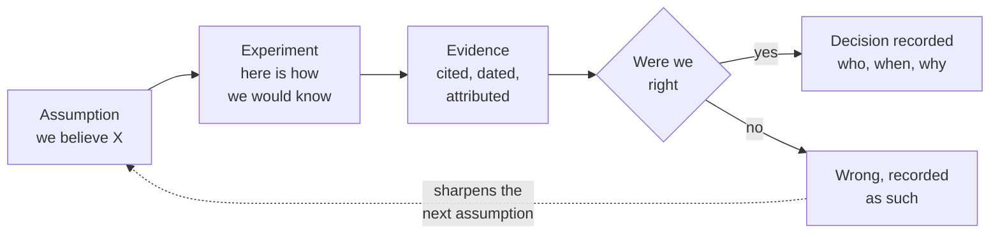

<svg xmlns="http://www.w3.org/2000/svg" viewBox="0 0 960 160" width="960" height="160">
  <rect width="960" height="160" rx="12" fill="#0B3D2E"/>
  <text x="48" y="58" font-family="system-ui, -apple-system, sans-serif" font-size="16" font-weight="600" letter-spacing="3" fill="#4ADE80" text-anchor="start">04 · TRACE</text>
  <text x="48" y="108" font-family="system-ui, -apple-system, sans-serif" font-size="48" font-weight="700" fill="#FFFFFF" text-anchor="start">See what changed,</text>
  <text x="48" y="148" font-family="system-ui, -apple-system, sans-serif" font-size="48" font-weight="700" fill="#FFFFFF" text-anchor="start">who changed it, and why</text>
  <circle cx="900" cy="80" r="36" fill="none" stroke="#4ADE80" stroke-width="2"/>
  <text x="900" y="88" font-family="system-ui, -apple-system, sans-serif" font-size="28" font-weight="700" fill="#4ADE80" text-anchor="middle">04</text>
</svg>

&nbsp;

## The record that writes itself

Unlike hitting save in a word processor, every change in a repository carries a mandatory written message explaining why. That requirement alone changes behavior. It forces the team to justify their thinking incrementally.

&nbsp;

This is not about engineering handoff. Traceability matters to the product team throughout: when reconsidering a strategy, when onboarding a new team member, when your VP asks why you dropped a feature last quarter. The answer is in the record, not in someone's memory.

In plain English: a finding that says "we were wrong" is only valuable if it is findable later.

> **"You can revert a belief. You cannot revert a market."**

&nbsp;

---

Beyond the Backlog · Productside · September 2, 2026

---

[&larr; Review](06_review.md) · [Next: Experiment &rarr;](08_experiment.md) · [Run](run.md)
