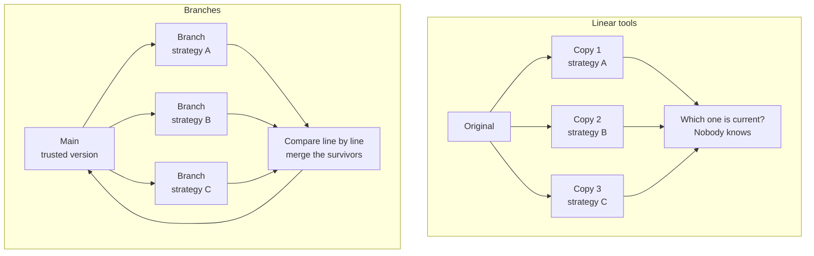
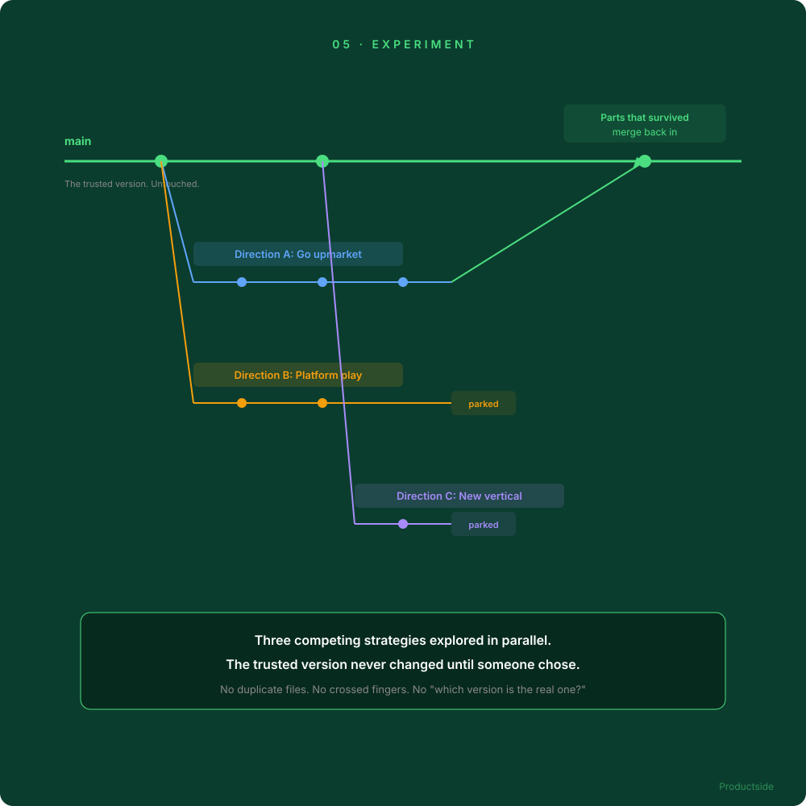

<svg xmlns="http://www.w3.org/2000/svg" viewBox="0 0 960 160" width="960" height="160">
  <rect width="960" height="160" rx="12" fill="#0B3D2E"/>
  <text x="48" y="58" font-family="system-ui, -apple-system, sans-serif" font-size="16" font-weight="600" letter-spacing="3" fill="#4ADE80" text-anchor="start">05 · EXPERIMENT</text>
  <text x="48" y="108" font-family="system-ui, -apple-system, sans-serif" font-size="48" font-weight="700" fill="#FFFFFF" text-anchor="start">Explore alternatives without</text>
  <text x="48" y="148" font-family="system-ui, -apple-system, sans-serif" font-size="48" font-weight="700" fill="#FFFFFF" text-anchor="start">breaking what works</text>
  <circle cx="900" cy="80" r="36" fill="none" stroke="#4ADE80" stroke-width="2"/>
  <text x="900" y="88" font-family="system-ui, -apple-system, sans-serif" font-size="28" font-weight="700" fill="#4ADE80" text-anchor="middle">05</text>
</svg>

&nbsp;

## Parallel exploration vs. linear revision

Experimentation is a daily habit for product managers. It should not be a version control risk. When your team has three competing strategic directions, you should not need three duplicate files and crossed fingers.

&nbsp;

Try competing strategies, hypotheses, problem framings, requirements, prompts, or product bets. The trusted version stays untouched until someone deliberately merges the parts that survived.

In plain English: curiosity and experimentation should be daily habits, not massive risks that threaten to overwrite the master strategy document.

> **"Stars are not market share. Issue volume is not pain severity. Test the bet before you commit the quarter."**

&nbsp;

---

Beyond the Backlog · Productside · September 2, 2026

---

[&larr; Trace](07_trace.md) · [Next: Augment &rarr;](09_augment.md) · [Run](run.md)
