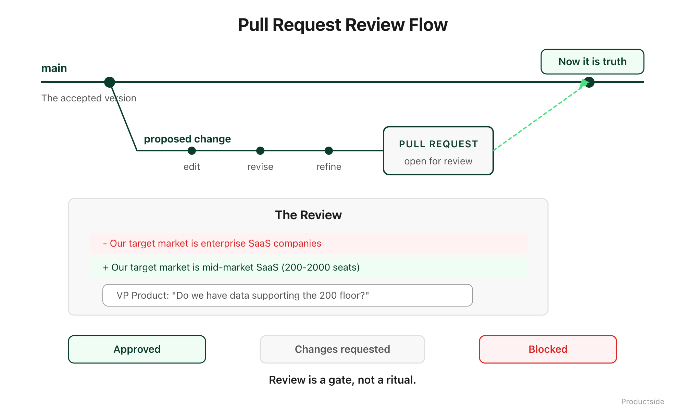

<svg xmlns="http://www.w3.org/2000/svg" viewBox="0 0 960 160" width="960" height="160">
  <rect width="960" height="160" rx="12" fill="#0B3D2E"/>
  <text x="48" y="58" font-family="system-ui, -apple-system, sans-serif" font-size="16" font-weight="600" letter-spacing="3" fill="#4ADE80" text-anchor="start">03 · REVIEW</text>
  <text x="48" y="108" font-family="system-ui, -apple-system, sans-serif" font-size="48" font-weight="700" fill="#FFFFFF" text-anchor="start">Challenge changes before</text>
  <text x="48" y="148" font-family="system-ui, -apple-system, sans-serif" font-size="48" font-weight="700" fill="#FFFFFF" text-anchor="start">they become truth.</text>
  <circle cx="900" cy="80" r="36" fill="none" stroke="#4ADE80" stroke-width="2"/>
  <text x="900" y="88" font-family="system-ui, -apple-system, sans-serif" font-size="28" font-weight="700" fill="#4ADE80" text-anchor="middle">03</text>
</svg>

&nbsp;

## 03 · Review

Product strategy should not mutate silently. A pull request is a structured moment where someone says "here is what I want to change and why," and someone else says "let me look at that before it goes live."

&nbsp;

&nbsp;

In most product teams, strategy documents change and nobody notices until the consequences arrive. Someone updates the target market. Someone rewrites a key requirement. Someone adjusts the pricing model. All of these are legitimate changes. None of them should happen without a second pair of eyes.

**Review bets.** When the team proposes a new strategic direction, the pull request shows exactly what is changing from the current position. Reviewers see the delta, not just the new version.

**Requirements.** Before a requirement changes, the people who will be affected can see what is being proposed and weigh in. Not after shipping. Before merging.

**Positioning.** When someone rewrites the positioning statement, the review shows the old language next to the new. You can see whether the change is a refinement or a pivot.

**Prompts.** AI prompts that the team relies on should not change without review. A prompt that worked well for competitive analysis might break if someone edits it without understanding why it was structured that way.

**Decisions.** A decision record that gets quietly edited after the fact is worse than no record at all. Review protects the integrity of what the team agreed to.

In plain English: review is not about gatekeeping. It is about making sure that when your product thinking evolves, it evolves on purpose.

> **"Review protects product thinking from silent drift."**

&nbsp;

**Adoption and limits**

- *Use this when* your product artifacts influence decisions beyond your immediate team, or when silent edits have caused confusion in the past.
- *Skip it when* you are in early exploration mode and speed matters more than precision. Use branches freely, review later.
- *What it does not do:* review catches intentional changes. It does not catch omissions or things nobody thought to write down.

&nbsp;

---

Beyond the Backlog · Productside · September 2, 2026

---

[← Previous](07_collaborate.md) · [Next: 04 · Trace →](09_trace.md) · [Run](run.md)
