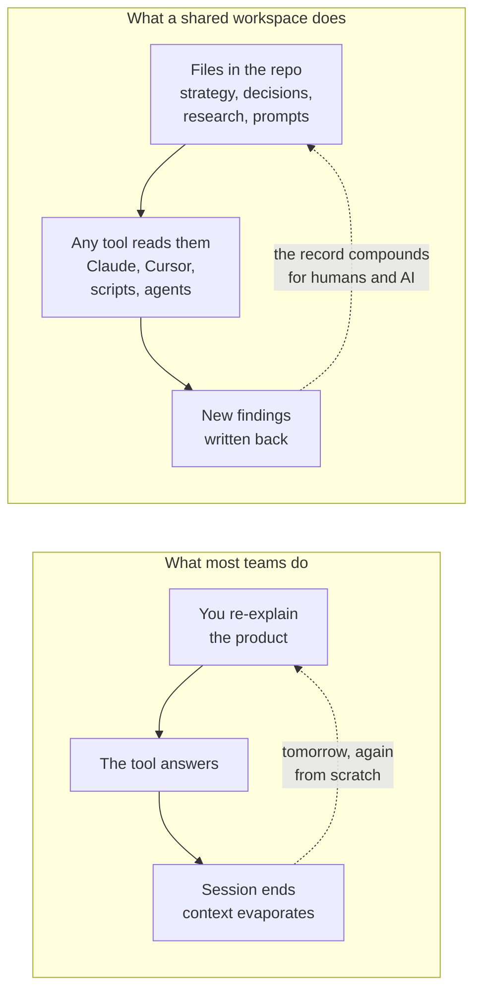
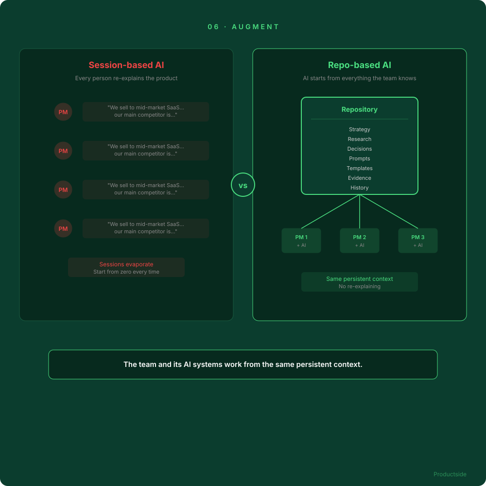

<svg xmlns="http://www.w3.org/2000/svg" viewBox="0 0 960 160" width="960" height="160">
  <rect width="960" height="160" rx="12" fill="#0B3D2E"/>
  <text x="48" y="58" font-family="system-ui, -apple-system, sans-serif" font-size="16" font-weight="600" letter-spacing="3" fill="#4ADE80" text-anchor="start">06 · AUGMENT</text>
  <text x="48" y="108" font-family="system-ui, -apple-system, sans-serif" font-size="48" font-weight="700" fill="#FFFFFF" text-anchor="start">Give AI the same context</text>
  <text x="48" y="148" font-family="system-ui, -apple-system, sans-serif" font-size="48" font-weight="700" fill="#FFFFFF" text-anchor="start">as the team</text>
  <circle cx="900" cy="80" r="36" fill="none" stroke="#4ADE80" stroke-width="2"/>
  <text x="900" y="88" font-family="system-ui, -apple-system, sans-serif" font-size="28" font-weight="700" fill="#4ADE80" text-anchor="middle">06</text>
</svg>

&nbsp;

## From everyone's chatbot to the team's shared context

Right now, every person on the team maintains their own AI context. They re-explain the product, the strategy, and the constraints at the start of every session. That is the individual version of the same problem the team already has with documents.

&nbsp;

The shift is not "AI can read your strategy." The shift is that the team and its AI systems work from the same persistent context, instead of everyone maintaining separate chatbot sessions that evaporate at the end of every conversation.

In plain English: your AI starts every conversation from everything the team already knows, not from your memory of what to tell it.

&nbsp;

---

Beyond the Backlog · Productside · September 2, 2026

---

[&larr; Experiment](08_experiment.md) · [Next: Reuse &rarr;](10_reuse.md) · [Run](run.md)
