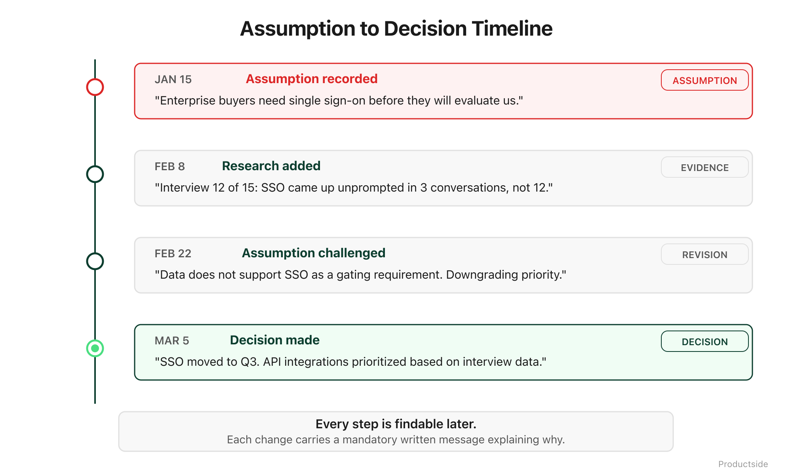

<svg xmlns="http://www.w3.org/2000/svg" viewBox="0 0 960 160" width="960" height="160">
  <rect width="960" height="160" rx="12" fill="#0B3D2E"/>
  <text x="48" y="58" font-family="system-ui, -apple-system, sans-serif" font-size="16" font-weight="600" letter-spacing="3" fill="#4ADE80" text-anchor="start">04 · TRACE</text>
  <text x="48" y="108" font-family="system-ui, -apple-system, sans-serif" font-size="48" font-weight="700" fill="#FFFFFF" text-anchor="start">See what changed</text>
  <text x="48" y="148" font-family="system-ui, -apple-system, sans-serif" font-size="48" font-weight="700" fill="#FFFFFF" text-anchor="start">and why.</text>
  <circle cx="900" cy="80" r="36" fill="none" stroke="#4ADE80" stroke-width="2"/>
  <text x="900" y="88" font-family="system-ui, -apple-system, sans-serif" font-size="28" font-weight="700" fill="#4ADE80" text-anchor="middle">04</text>
</svg>

&nbsp;

## 04 · Trace

Product work has lineage. Every strategy pivot, every requirement change, every decision has a before and an after. Trace is the capability that makes that lineage visible without anyone having to maintain it.

&nbsp;

&nbsp;

This is the capability most product teams do not know they are missing until the question arrives: "Why did we drop that feature?" or "When did the target market change?" or "Who decided to cut the enterprise tier?"

**Who changed it.** Every commit has an author. Not "someone on the team." A name, a date, a record.

**What changed.** The diff shows exactly which lines were added, removed, or modified. Not "the doc was updated." The specific words that changed.

**Why it changed.** The commit message and pull request description capture the reasoning. Six months from now, you will not have to reconstruct the logic from memory. It is there.

**What was rejected.** Closed pull requests are not deleted. They are archived. The idea that was proposed, discussed, and decided against is still findable. That matters because rejected options are context too. They tell the next person "we already considered that, and here is why we did not do it."

In plain English: trace turns "I think we changed that sometime in Q2" into "we changed it on March 14th, here is the pull request, here is the discussion, and here is who approved it." That is not a nice-to-have. That is the difference between a team that learns and a team that repeats its own mistakes.

> **"Keep the path, not just the artifact."**

&nbsp;

**Adoption and limits**

- *Use this when* your team has ever spent more than ten minutes reconstructing why a decision was made, or when onboarding new team members takes longer than it should.
- *Skip it when* you are working on truly disposable artifacts that will not matter in two weeks.
- *What it does not do:* trace records what happened in the repo. It does not capture decisions made in meetings or Slack unless someone writes them down and commits them.

&nbsp;

---

Beyond the Backlog · Productside · September 2, 2026

---

[← Previous](08_review.md) · [Next: 05 · Experiment →](10_experiment.md) · [Run](run.md)
