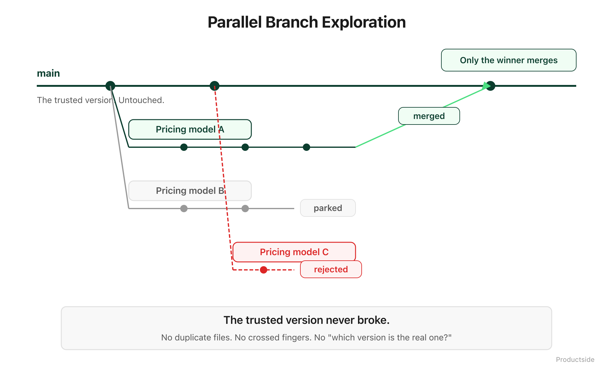

<svg xmlns="http://www.w3.org/2000/svg" viewBox="0 0 960 160" width="960" height="160">
  <rect width="960" height="160" rx="12" fill="#0B3D2E"/>
  <text x="48" y="58" font-family="system-ui, -apple-system, sans-serif" font-size="16" font-weight="600" letter-spacing="3" fill="#4ADE80" text-anchor="start">05 · EXPERIMENT</text>
  <text x="48" y="108" font-family="system-ui, -apple-system, sans-serif" font-size="48" font-weight="700" fill="#FFFFFF" text-anchor="start">Parallel realities</text>
  <text x="48" y="148" font-family="system-ui, -apple-system, sans-serif" font-size="48" font-weight="700" fill="#FFFFFF" text-anchor="start">without wreckage.</text>
  <circle cx="900" cy="80" r="36" fill="none" stroke="#4ADE80" stroke-width="2"/>
  <text x="900" y="88" font-family="system-ui, -apple-system, sans-serif" font-size="28" font-weight="700" fill="#4ADE80" text-anchor="middle">05</text>
</svg>

&nbsp;

## 05 · Experiment

Explore without corrupting the trusted version. A branch lets you try a different direction, compare it to the current one, and decide whether to keep it, all without touching what the team is relying on today.

&nbsp;

&nbsp;

Product work involves bets. "What if we repositioned for mid-market?" "What if we restructured the requirements around jobs-to-be-done?" "What if we rewrote the pricing page for a different buyer?" These are legitimate explorations, and they should not require overwriting the current version to find out.

**Branch bets.** Create a branch for each experiment. The current strategy stays on main. Your exploratory rewrite lives on its own branch. Both versions exist at the same time.

**Compare alternatives.** Pull up both versions side by side. See exactly where they differ. This is not "I remember the old version being something like..." This is a line-by-line comparison you can show to the team.

**Merge survivors.** When an experiment works, merge it into the main branch through a pull request. It goes through review. It gets a record. The winning idea becomes the new baseline with full traceability.

**Archive losers.** When an experiment does not work, the branch stays as a record. You do not delete the work. You close the pull request with a note about why it was not adopted. The next person who has the same idea can find it.

In plain English: branches give you a sandbox. Try things. Compare them to what you have. Keep what works. The version your team trusts never gets touched until you are ready.

> **"Experimentation stops being version hell."**

&nbsp;

**Adoption and limits**

- *Use this when* your team debates strategic alternatives and you want to compare them concretely, not abstractly.
- *Skip it when* you are making small, uncontroversial updates. Not everything needs a branch. A typo fix can go straight to main.
- *What it does not do:* experimentation in a repo is about document-level exploration, not live A/B testing with real users. That is a different tool for a different job.

&nbsp;

---

Beyond the Backlog · Productside · September 2, 2026

---

[← Previous](09_trace.md) · [Next: 06 · Augment →](11_augment.md) · [Run](run.md)
