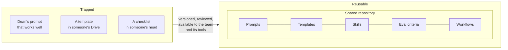
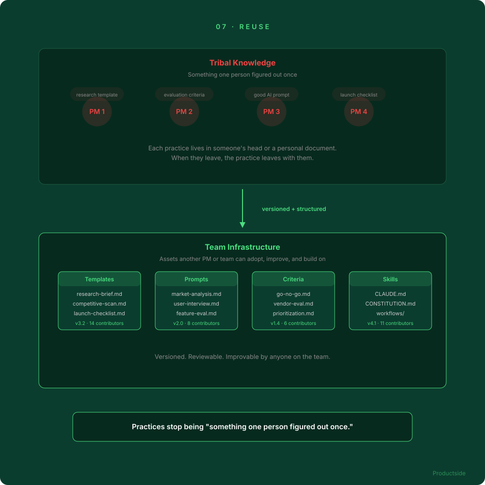

<svg xmlns="http://www.w3.org/2000/svg" viewBox="0 0 960 160" width="960" height="160">
  <rect width="960" height="160" rx="12" fill="#0B3D2E"/>
  <text x="48" y="58" font-family="system-ui, -apple-system, sans-serif" font-size="16" font-weight="600" letter-spacing="3" fill="#4ADE80" text-anchor="start">07 · REUSE</text>
  <text x="48" y="108" font-family="system-ui, -apple-system, sans-serif" font-size="48" font-weight="700" fill="#FFFFFF" text-anchor="start">Turn practices into</text>
  <text x="48" y="148" font-family="system-ui, -apple-system, sans-serif" font-size="48" font-weight="700" fill="#FFFFFF" text-anchor="start">reusable assets</text>
  <circle cx="900" cy="80" r="36" fill="none" stroke="#4ADE80" stroke-width="2"/>
  <text x="900" y="88" font-family="system-ui, -apple-system, sans-serif" font-size="28" font-weight="700" fill="#4ADE80" text-anchor="middle">07</text>
</svg>

&nbsp;

## From tribal knowledge to team infrastructure

Every product team has practices that work: a research template that gets filled out the same way, a prompt that produces good competitive analysis, a set of evaluation criteria for prioritization, a checklist that prevents the same mistake twice.

Right now those live in someone's head, in a personal document, or in a chat history that nobody else can find.

&nbsp;

When product practices are versioned, structured assets in a shared workspace, they stop being "something one person figured out once" and become something another PM or team can actually adopt, improve, and build on.

In plain English: the team's best practices compound the same way its context does.

> **"Could we accidentally expose something sensitive? Yes, if we were sloppy. Which is why we are not being sloppy."**

&nbsp;

---

Beyond the Backlog · Productside · September 2, 2026

---

[&larr; Augment](09_augment.md) · [Next: The honest part &rarr;](11_the-honest-part.md) · [Run](run.md)
