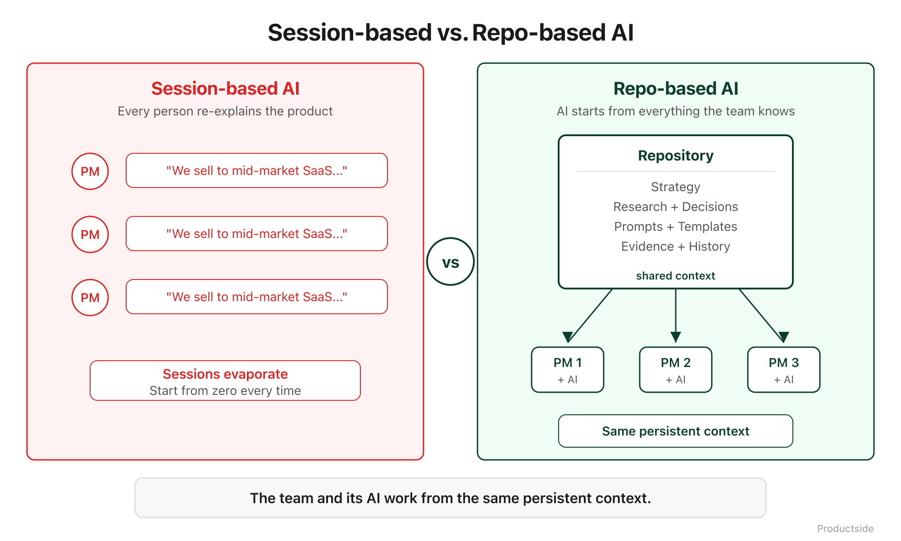

<svg xmlns="http://www.w3.org/2000/svg" viewBox="0 0 960 160" width="960" height="160">
  <rect width="960" height="160" rx="12" fill="#0B3D2E"/>
  <text x="48" y="58" font-family="system-ui, -apple-system, sans-serif" font-size="16" font-weight="600" letter-spacing="3" fill="#4ADE80" text-anchor="start">06 · AUGMENT</text>
  <text x="48" y="108" font-family="system-ui, -apple-system, sans-serif" font-size="48" font-weight="700" fill="#FFFFFF" text-anchor="start">AI uses</text>
  <text x="48" y="148" font-family="system-ui, -apple-system, sans-serif" font-size="48" font-weight="700" fill="#FFFFFF" text-anchor="start">team context.</text>
  <circle cx="900" cy="80" r="36" fill="none" stroke="#4ADE80" stroke-width="2"/>
  <text x="900" y="88" font-family="system-ui, -apple-system, sans-serif" font-size="28" font-weight="700" fill="#4ADE80" text-anchor="middle">06</text>
</svg>

&nbsp;

## 06 · Augment

Better AI starts with shared context. When your AI tools can read a repo, they start with what the team knows, not with what one person remembers to paste into a chat window.

&nbsp;

&nbsp;

Here is the AI problem nobody talks about in product teams: every AI tool starts with a blank slate. ChatGPT does not know your product strategy. Claude does not know your competitive landscape. Copilot does not know why you chose this market segment over that one. So every conversation starts with you re-explaining your product from scratch.

A repo changes that equation.

**Repo-readable artifacts.** When your strategy, research, requirements, and decision records live in a repo, AI tools that can read the repo start with that context. You do not paste it in. You do not re-explain it. It is there.

**Shared prompts.** The prompts your team uses for competitive analysis, feature evaluation, or requirements drafting live in the repo. Everyone uses the same prompts. The prompts improve over time through the same review process as everything else.

**Reusable instructions.** A CLAUDE.md file in the repo tells an AI tool how to work with this product. What the product is, what the audience cares about, what the vocabulary rules are. Every conversation starts with that context instead of "let me explain our product to you again."

**Less re-explaining.** This is the real payoff. Not "AI is smarter." AI is the same. Your team just stops wasting the first ten minutes of every AI conversation rebuilding context.

In plain English: the difference between a private chatbot rodeo and a team AI workflow is shared context. The repo is that shared context.

> **"From private chatbot rodeos to team workflows."**

&nbsp;

**Adoption and limits**

- *Use this when* your team uses AI tools and you are tired of everyone re-explaining the product from scratch every session.
- *Skip it when* your team does not use AI tools yet. Get the first five capabilities working first.
- *What it does not do:* putting files in a repo does not automatically make every AI tool read them. The AI tool needs repo access, and not all tools have it yet. This capability is growing fast, but it is not universal.

&nbsp;

---

Beyond the Backlog · Productside · September 2, 2026

---

[← Previous](10_experiment.md) · [Next: 07 · Reuse →](12_reuse.md) · [Run](run.md)
