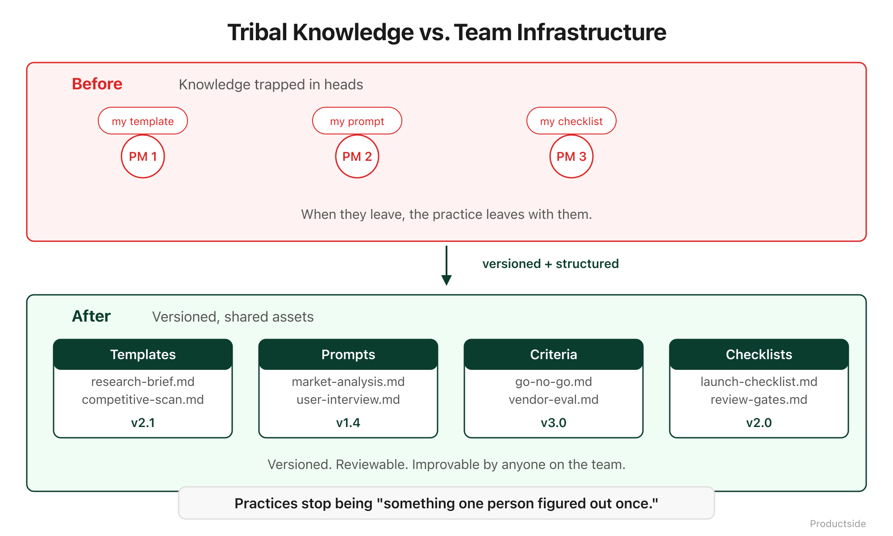

<svg xmlns="http://www.w3.org/2000/svg" viewBox="0 0 960 160" width="960" height="160">
  <rect width="960" height="160" rx="12" fill="#0B3D2E"/>
  <text x="48" y="58" font-family="system-ui, -apple-system, sans-serif" font-size="16" font-weight="600" letter-spacing="3" fill="#4ADE80" text-anchor="start">07 · REUSE</text>
  <text x="48" y="108" font-family="system-ui, -apple-system, sans-serif" font-size="48" font-weight="700" fill="#FFFFFF" text-anchor="start">Turn good work</text>
  <text x="48" y="148" font-family="system-ui, -apple-system, sans-serif" font-size="48" font-weight="700" fill="#FFFFFF" text-anchor="start">into assets.</text>
  <circle cx="900" cy="80" r="36" fill="none" stroke="#4ADE80" stroke-width="2"/>
  <text x="900" y="88" font-family="system-ui, -apple-system, sans-serif" font-size="28" font-weight="700" fill="#4ADE80" text-anchor="middle">07</text>
</svg>

&nbsp;

## 07 · Reuse

Practices should travel. The best product teams do not reinvent their approach for every new product, every new quarter, every new hire. They build once, refine continuously, and reuse deliberately.

&nbsp;

&nbsp;

This is where the investment in the first six capabilities starts to compound. Everything you shared, reviewed, traced, and refined becomes raw material for the next product, the next team, the next hire.

**Templates.** Your PRD template, your decision record format, your competitive analysis framework. In the repo, versioned, improvable. Not in someone's "Templates" folder on their laptop.

**Prompts.** The AI prompts that work well become shared assets. A prompt that generates good competitive analysis for one product can be adapted for the next one. It does not disappear when the person who wrote it moves to another team.

**Skills.** Structured instructions that tell an AI tool how to perform a specific product task. "Evaluate this feature request against our strategy" becomes a repeatable, improvable skill, not a one-off conversation.

**Playbooks.** The step-by-step process for launching a product, running a sprint review, or conducting a discovery interview. Documented, versioned, and available to anyone on the team.

**Evals.** How you measure whether an AI prompt or workflow is actually producing good results. These are testable, repeatable, and they prevent prompt drift.

**Operating models.** The way your team works, captured in a format that a new hire can read on day one and a new product team can adopt on day thirty.

In plain English: most product teams do great work that dies in the project that created it. Reuse is how good work becomes infrastructure.

> **"Good work becomes infrastructure."**

&nbsp;

**Adoption and limits**

- *Use this when* you find yourself rebuilding the same frameworks, templates, or processes for every new initiative.
- *Skip it when* you are still figuring out what works. Premature standardization is its own trap. Get through a few cycles of Share, Collaborate, and Review first.
- *What it does not do:* reuse does not mean one-size-fits-all. Templates and playbooks are starting points, not mandates. The team should adapt them, and those adaptations go through the same review process.

&nbsp;

---

Beyond the Backlog · Productside · September 2, 2026

---

[← Previous](11_augment.md) · [Next: Monday Demo Path →](13_monday-demo.md) · [Run](run.md)
