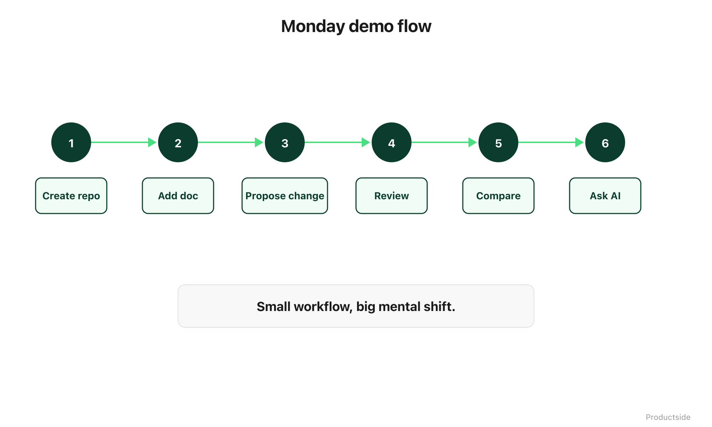

<svg xmlns="http://www.w3.org/2000/svg" viewBox="0 0 960 160" width="960" height="160">
  <rect width="960" height="160" rx="12" fill="#1a1a1a"/>
  <text x="48" y="58" font-family="system-ui, -apple-system, sans-serif" font-size="16" font-weight="600" letter-spacing="3" fill="#94D2BD" text-anchor="start">MONDAY DEMO PATH</text>
  <text x="48" y="108" font-family="system-ui, -apple-system, sans-serif" font-size="48" font-weight="700" fill="#FFFFFF" text-anchor="start">Make it</text>
  <text x="48" y="148" font-family="system-ui, -apple-system, sans-serif" font-size="48" font-weight="700" fill="#FFFFFF" text-anchor="start">feel doable.</text>
  <text x="912" y="140" font-family="system-ui, -apple-system, sans-serif" font-size="14" fill="#94D2BD" text-anchor="end">Productside</text>
</svg>

&nbsp;

## Monday Demo Path

The room needs "I could try that Monday." Not "that sounds interesting, I'll think about it." Doable. This week. Without asking IT for permission or learning a new programming language.

&nbsp;

&nbsp;

Everything in this webinar is real. But real does not matter if the audience walks away thinking "that's for technical teams." The demo path exists to close that gap. Six steps, all in the browser, all without typing a single command.

**Create a repo.** Click "New repository." Give it a name. Pick private. Done. You have a workspace.

**Add a document.** Click "Add file." Paste in your strategy doc or positioning statement. Commit it. The file now has an author, a timestamp, and a permanent address.

**Propose a change.** Edit the file on a branch. Submit a pull request. You just separated "here is what I want to change" from "here is what we all agree on."

**Review.** Look at the diff. Leave a comment. Approve or request changes. This is the moment where most PMs realize: "Wait, this is just track changes with a conversation attached."

**Compare.** Look at the commit history. See what the file looked like last week vs. today. The timeline is there without anyone maintaining it.

**Ask AI.** Point an AI tool at the repo. Ask it a question about your product. Watch it answer using the context your team put there, not a blank slate.

In plain English: the demo is not about impressing the audience. It is about lowering the activation energy. If someone can picture themselves doing step one on Monday, the other six capabilities become a matter of time, not a leap of faith.

> **"Small workflow, big mental shift."**

&nbsp;

---

Beyond the Backlog · Productside · September 2, 2026

---

[← Previous](12_reuse.md) · [Next: Where This Fits →](14_where-this-fits.md) · [Run](run.md)
