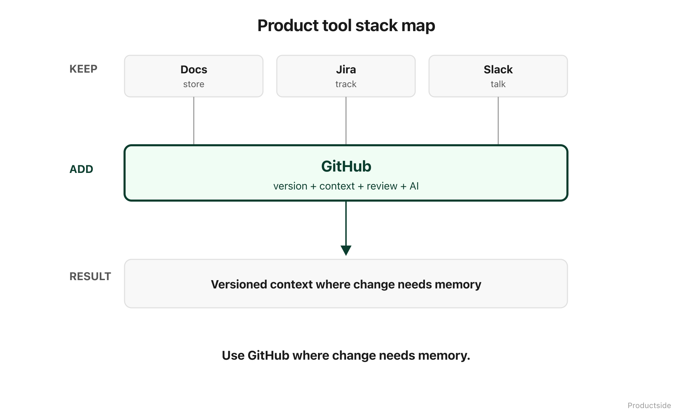

<svg xmlns="http://www.w3.org/2000/svg" viewBox="0 0 960 160" width="960" height="160">
  <rect width="960" height="160" rx="12" fill="#1a1a1a"/>
  <text x="48" y="58" font-family="system-ui, -apple-system, sans-serif" font-size="16" font-weight="600" letter-spacing="3" fill="#94D2BD" text-anchor="start">WHERE THIS FITS</text>
  <text x="48" y="108" font-family="system-ui, -apple-system, sans-serif" font-size="48" font-weight="700" fill="#FFFFFF" text-anchor="start">GitHub joins</text>
  <text x="48" y="148" font-family="system-ui, -apple-system, sans-serif" font-size="48" font-weight="700" fill="#FFFFFF" text-anchor="start">the stack.</text>
  <text x="912" y="140" font-family="system-ui, -apple-system, sans-serif" font-size="14" fill="#94D2BD" text-anchor="end">Productside</text>
</svg>

&nbsp;

## Where This Fits

This is not a tool religion. Nobody is asking you to abandon Confluence, cancel your Jira subscription, or stop using Slack. GitHub fills a specific gap in the product toolstack, and the honest answer is that you should use it where it fits and skip it where it does not.

&nbsp;

&nbsp;

**Keep your docs platform.** Google Docs, Confluence, Notion. These are good at real-time collaborative editing, rich formatting, and stakeholder-friendly presentations. They are not going away, and they should not.

**Keep your delivery tracker.** Jira, Linear, Shortcut. Sprint planning, velocity tracking, backlog management. Purpose-built and battle-tested.

**Keep your communication tool.** Slack, Teams. Real-time coordination, quick decisions, social connection. Essential.

**Add versioned context where it is useful.** GitHub is for the artifacts that evolve over time and where you need to know what changed, who changed it, and why. Strategy documents that pivot. Requirements that mature. Decision records that accumulate. AI prompts that improve. Templates that standardize.

The litmus test is simple: does this artifact change over time, and would you want to see how it changed? If yes, it belongs in the repo. If no, it belongs wherever it lives today.

In plain English: you are not replacing your toolstack. You are filling the gap where none of your current tools track how your product thinking evolves. That is a specific, bounded job, and GitHub does it well.

> **"Use GitHub where change needs memory."**

&nbsp;

---

Beyond the Backlog · Productside · September 2, 2026

---

[← Previous](13_monday-demo.md) · [Next: Close →](15_close.md) · [Run](run.md)
