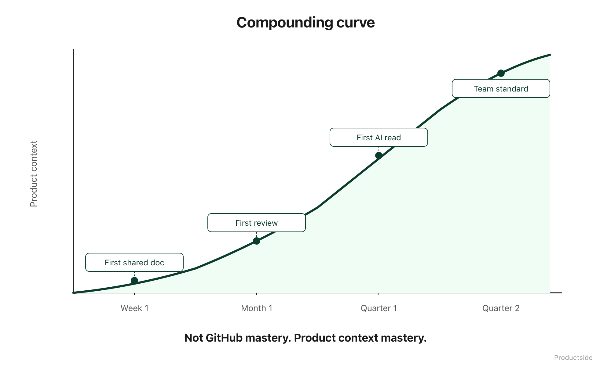

<svg xmlns="http://www.w3.org/2000/svg" viewBox="0 0 960 160" width="960" height="160">
  <rect width="960" height="160" rx="12" fill="#1a1a1a"/>
  <text x="48" y="58" font-family="system-ui, -apple-system, sans-serif" font-size="16" font-weight="600" letter-spacing="3" fill="#94D2BD" text-anchor="start">CLOSE</text>
  <text x="48" y="108" font-family="system-ui, -apple-system, sans-serif" font-size="48" font-weight="700" fill="#FFFFFF" text-anchor="start">Compounding</text>
  <text x="48" y="148" font-family="system-ui, -apple-system, sans-serif" font-size="48" font-weight="700" fill="#FFFFFF" text-anchor="start">product knowledge.</text>
  <text x="912" y="140" font-family="system-ui, -apple-system, sans-serif" font-size="14" fill="#94D2BD" text-anchor="end">Productside</text>
</svg>

&nbsp;

## Close

The future Product Manager is not a Git expert. They are not someone who memorizes command-line syntax or debates merge strategies. They are someone whose product thinking compounds instead of evaporating.

&nbsp;

&nbsp;

Here is what changes when product context lives in a shared, versioned, AI-readable workspace:

**Shared context.** Everyone on the team sees the same artifacts. New hires find what they need without a scavenger hunt. The product's institutional memory does not depend on any one person's recollection.

**Better decisions.** When you can see how your strategy evolved, you make better bets. When rejected alternatives are findable, you stop re-debating settled questions. When decisions have attribution and reasoning attached, accountability becomes natural instead of political.

**Better AI.** When your AI tools start with team context, they produce better results with less prompting. Shared prompts improve over time. Reusable instructions mean the AI gets smarter about your product without anyone re-explaining it.

**Less archaeology.** The Monday morning ritual of "find the latest version, reconstruct the decision, re-explain the product" fades. Not because the tools are smarter. Because the context is already there.

This is not about GitHub mastery. It is about product context mastery. GitHub is the vehicle. The destination is a team that learns faster because it remembers better.

Not everything belongs in a repo. Not everything should be public. And nobody is being asked to become a developer. But the team that versions its thinking will outperform the team that keeps starting from scratch.

> **"Not GitHub mastery. Product context mastery."**

&nbsp;

---

Beyond the Backlog · Productside · September 2, 2026

---

[← Previous](14_where-this-fits.md) · [Run](run.md)
